# Agentic AI Integration with Model Context Protocol (MCP)

## 🤖 **Overview: From Analysis to Action**

This enhancement transforms the Sybil AI system from **passive analysis** to **active assistance**, enabling AI agents to take real-time actions during voice conversations using the Model Context Protocol (MCP) framework.

---

## 🔄 **Traditional AI vs Agentic AI**

### **Before: Analysis Only**
```
Customer: "I want to cancel order #12345"
AI Response: 🎯 Intent detected: cancellation
Agent Action: Manually looks up order, checks policy, processes cancellation
```

### **After: Agentic Actions**
```
Customer: "I want to cancel order #12345"
AI Agent:    1. 🔍 Automatically looks up order #12345
            2. ✅ Checks cancellation eligibility
            3. 💳 Calculates refund amount
            4. 📋 Prepares cancellation for agent approval
            5. 📧 Drafts confirmation email
Agent Action: Reviews and approves with one click
```

---

## 🧠 **Model Context Protocol (MCP) Integration**

### **What is MCP?**
MCP is a standardized protocol that allows AI models to:
- **Access external tools and services** during conversations
- **Maintain context** across multiple interactions
- **Take actions** based on real-time data
- **Integrate with existing business systems**

### **Our MCP Implementation**

```typescript
// Available MCP Tools in Our System
const tools = [
  'lookup_customer',     // Customer profile & account data
  'get_orders',          // Order history & status
  'cancel_order',        // Order cancellation processing
  'process_refund',      // Refund handling
  'create_support_ticket', // Support case creation
  'send_email',          // Automated communications
  'escalate_to_supervisor', // Call escalation
  'apply_discount'       // Promotional offers
];
```

---

## ⚡ **Agentic Action Types**

### **1. 🔍 Lookup Actions (Auto-Execute)**
**Risk Level**: Low | **Approval**: Not Required

```typescript
// Triggered by: Customer mentions account, orders, or personal info
Examples:
- "What's my order status?" → lookup_customer + get_orders
- "I can't access my account" → lookup_customer + recent_activity
- "When will my package arrive?" → get_orders + shipping_tracking
```

### **2. ✏️ Modify Actions (Requires Approval)**
**Risk Level**: Medium-High | **Approval**: Required

```typescript
// Triggered by: Change requests, cancellations, updates
Examples:
- "Cancel my order" → cancel_order (requires approval)
- "Update my address" → update_customer_profile (requires approval)
- "Change my delivery date" → modify_order (requires approval)
```

### **3. 💳 Financial Actions (Requires Approval)**
**Risk Level**: High | **Approval**: Always Required

```typescript
// Triggered by: Payment issues, refunds, discounts
Examples:
- "I want a refund" → process_refund (requires approval)
- "Can you give me a discount?" → apply_discount (requires approval)
- "Charge failed" → retry_payment (requires approval)
```

### **4. 📧 Communication Actions (Requires Approval)**
**Risk Level**: Medium | **Approval**: Required

```typescript
// Triggered by: Information requests, documentation needs
Examples:
- "Send me my receipt" → send_email with receipt template
- "I need documentation" → send_email with relevant docs
- "Email me the details" → send_email with conversation summary
```

### **5. ⬆️ Escalation Actions (Requires Approval)**
**Risk Level**: High | **Approval**: Required

```typescript
// Triggered by: Complex issues, escalation requests
Examples:
- "I want to speak to your manager" → escalate_to_supervisor
- "This is unacceptable" → escalate_to_supervisor
- Long conversation (>20 exchanges) → suggest_escalation
```

---

## 🎯 **Real-Time Action Flow**

### **Step 1: Intent Detection**
```typescript
Customer says: "I need to cancel my order from last week"
AI detects: intent='cancellation' + entity='last_week'
```

### **Step 2: Context Gathering**
```typescript
AI automatically:
1. Looks up customer profile
2. Retrieves recent orders (last 7 days)
3. Identifies target order
4. Checks cancellation policy
```

### **Step 3: Action Preparation**
```typescript
AI prepares actions:
- lookup_customer (auto-execute ✅)
- get_orders (auto-execute ✅)
- cancel_order (requires approval ⏳)
- send_email confirmation (requires approval ⏳)
```

### **Step 4: Agent Interface**
```typescript
Agent sees:
📦 Order #67890 found - Wireless Headphones ($299.99)
✅ Eligible for cancellation (within 24hr window)
💳 Full refund available to original payment method

[Approve Cancellation] [Reject]
```

### **Step 5: Execution & Follow-up**
```typescript
Agent approves → AI executes:
1. ✅ Order cancelled
2. 💳 Refund processed ($299.99)
3. 📧 Confirmation email sent
4. 📋 Support ticket created for tracking
```

---

## 🔧 **Technical Architecture**

### **Agentic AI Service Structure**
```typescript
class AgenticAIService {
  // Core analysis function
  async analyzeForActions(conversation, insights): Promise<AgenticContext>
  
  // Action generation based on insights
  private async generateActionsForInsight(insight, conversation): Promise<AgenticAction[]>
  
  // MCP tool execution
  async executeAction(action): Promise<AgenticAction>
  
  // Agent approval workflow
  async approveAction(actionId): Promise<AgenticAction>
  rejectAction(actionId, reason): boolean
}
```

### **Action State Management**
```typescript
interface AgenticAction {
  id: string;
  type: 'lookup' | 'modify' | 'create' | 'communicate' | 'escalate';
  tool: string;  // MCP tool name
  status: 'pending' | 'in_progress' | 'completed' | 'failed';
  requiresAgentApproval: boolean;
  impact: 'low' | 'medium' | 'high';
  confidence: number;
  result?: any;  // MCP response data
}
```

---

## 📊 **Visual Architecture Diagrams**

### **System Overview Architecture**

```mermaid
graph TB
    subgraph "🎙️ Voice Conversation Layer"
        A[Customer Speech] --> B[Agent Interface]
        B --> C[Transcription Service]
        C --> D[Real-time Conversation History]
    end

    subgraph "🧠 AI Analysis & Decision Layer"
        D --> E[AI Analysis Service]
        E --> F[Intent Detection]
        E --> G[Entity Extraction]
        E --> H[Sentiment Analysis]
        
        F --> I[Agentic AI Service]
        G --> I
        H --> I
        
        I --> J{Action Generation}
        J --> K[🔍 Low Risk Actions<br/>Lookups, Analytics]
        J --> L[📧 Medium Risk Actions<br/>Communications, Updates]
        J --> M[💳 High Risk Actions<br/>Financial, Escalations]
    end

    subgraph "⚡ Model Context Protocol (MCP) Layer"
        K --> N[Auto-Execute<br/>No Approval]
        L --> O[Agent Approval<br/>Required]
        M --> P[Supervisor Approval<br/>Required]
        
        N --> Q[MCP Tools Execution]
        O --> R{Agent Decision}
        P --> S{Supervisor Decision}
        
        R -->|Approve| Q
        R -->|Reject| T[Action Rejected]
        S -->|Approve| Q
        S -->|Reject| T
    end

    subgraph "🏢 Business Systems Integration"
        Q --> U[👤 Customer Database<br/>Profile Lookup]
        Q --> V[📦 Order Management<br/>Order Operations]
        Q --> W[💳 Payment Systems<br/>Financial Operations]
        Q --> X[📧 Communication APIs<br/>Email & SMS]
        Q --> Y[🎫 Support Systems<br/>Ticket Management]
        Q --> Z[📊 Analytics Platform<br/>Action Tracking]
    end

    subgraph "🔄 Results & Feedback Layer"
        U --> AA[Action Results]
        V --> AA
        W --> AA
        X --> AA
        Y --> AA
        Z --> AA
        
        AA --> BB[🔮 Oracle Dashboard Update]
        AA --> CC[🚨 Agent Notification]
        AA --> DD[💬 Customer Response]
        
        BB --> EE[📝 Conversation Context Update]
        CC --> EE
        DD --> EE
        
        EE --> D
    end

    %% Styling
    classDef voiceLayer fill:#e1f5fe,stroke:#01579b,stroke-width:2px
    classDef aiLayer fill:#f3e5f5,stroke:#4a148c,stroke-width:2px
    classDef mcpLayer fill:#e8f5e8,stroke:#1b5e20,stroke-width:2px
    classDef businessLayer fill:#fff3e0,stroke:#e65100,stroke-width:2px
    classDef resultsLayer fill:#fce4ec,stroke:#880e4f,stroke-width:2px
    
    class A,B,C,D voiceLayer
    class E,F,G,H,I,J,K,L,M aiLayer
    class N,O,P,Q,R,S,T mcpLayer
    class U,V,W,X,Y,Z businessLayer
    class AA,BB,CC,DD,EE resultsLayer
```



### **Real-Time Action Flow Sequence**

```mermaid
sequenceDiagram
    participant C as 🎙️ Customer
    participant A as 👤 Agent Interface
    participant T as 📝 Transcription
    participant AI as 🧠 AI Analysis
    participant AG as 🤖 Agentic AI
    participant MCP as ⚡ MCP Tools
    participant BS as 🏢 Business Systems
    participant D as 🔮 Oracle Dashboard

    C->>A: "I want to cancel order #12345"
    A->>T: 🎵 Voice → Text Conversion
    T->>AI: 📊 Analyze: "cancel order #12345"
    AI->>AG: 🎯 Intent: cancellation, Entity: #12345
    
    Note over AG: 🧠 Generate Actions
    AG->>AG: 1. 🔍 lookup_order (auto)
    AG->>AG: 2. 💳 cancel_order (approval)
    AG->>AG: 3. 📧 send_confirmation (approval)
    
    AG->>MCP: ⚡ Execute lookup_order(#12345)
    MCP->>BS: 🔍 Query Order Database
    BS->>MCP: 📦 Order Details: $299.99, Eligible
    MCP->>AG: ✅ Order found, cancellable
    
    AG->>D: 🎯 Show order details + approval prompt
    D->>A: 📱 Display: "Order #12345 ready to cancel"
    A->>AG: ✅ Agent approves cancellation
    
    AG->>MCP: ⚡ Execute cancel_order(#12345)
    MCP->>BS: 🔄 Process Cancellation
    BS->>MCP: ✅ Cancelled, Refund Initiated
    
    AG->>MCP: ⚡ Execute send_confirmation(email)
    MCP->>BS: 📧 Send Email via Communication API
    BS->>MCP: ✅ Email sent successfully
    
    MCP->>D: 🎉 Update: All actions completed
    D->>A: 🎊 Show: "✅ Order cancelled, refund processed"
    A->>C: "Your order has been cancelled, refund in 3-5 days"
```



### **Action Risk Assessment & Approval Matrix**

```mermaid
graph TD
    A[🎯 Action Generated] --> B{Risk Assessment}
    
    B -->|Low Risk| C[🟢 Auto-Execute<br/>Lookups, Read-only]
    B -->|Medium Risk| D[🟡 Agent Approval<br/>Updates, Communications]
    B -->|High Risk| E[🔴 Supervisor Approval<br/>Financial, Escalations]
    B -->|Critical| F[⚫ Manual Only<br/>Account Deletion, Legal]
    
    C --> G[⚡ MCP Tool Execution]
    D --> H{Agent Decision}
    E --> I{Supervisor Decision}
    F --> J[🚫 Human Processing Required]
    
    H -->|✅ Approve| G
    H -->|❌ Reject| K[📝 Log Rejection Reason]
    I -->|✅ Approve| G
    I -->|❌ Reject| K
    
    G --> L[📊 Execute & Monitor]
    L --> M{Success?}
    M -->|✅ Success| N[🎉 Update Dashboard]
    M -->|❌ Failed| O[🚨 Error Handling]
    
    K --> P[📋 Action History]
    N --> P
    O --> Q[🔄 Retry Logic]
    Q --> R{Retry Possible?}
    R -->|Yes| G
    R -->|No| S[🚫 Mark as Failed]
    
    %% Styling
    classDef lowRisk fill:#c8e6c9,stroke:#2e7d32
    classDef mediumRisk fill:#fff3c4,stroke:#f57c00
    classDef highRisk fill:#ffcdd2,stroke:#c62828
    classDef critical fill:#f3e5f5,stroke:#6a1b9a
    classDef process fill:#e3f2fd,stroke:#1976d2
    
    class C lowRisk
    class D mediumRisk
    class E highRisk
    class F critical
    class G,L,M,N,O,Q,R process
```



### **Data Flow & Context Management**

```mermaid
graph LR
    subgraph "📥 Input Processing"
        A[🎙️ Voice Input] --> B[📝 Speech-to-Text]
        B --> C[🎯 Intent Recognition]
        C --> D[🏷️ Entity Extraction]
    end

    subgraph "🧠 Intelligence Layer"
        D --> E[🔍 Context Analysis]
        E --> F[📋 Action Planning]
        F --> G[⚖️ Risk Assessment]
    end

    subgraph "⚡ Execution Engine"
        G --> H{🎚️ Risk Level?}
        H -->|🟢 Low| I[🤖 Auto Execute]
        H -->|🟡 Medium| J[👤 Agent Approval]
        H -->|🔴 High| K[👔 Supervisor Approval]
        
        I --> L[⚡ MCP Tool Call]
        J --> M{✅ Approved?}
        K --> N{✅ Approved?}
        M -->|Yes| L
        N -->|Yes| L
        M -->|No| O[❌ Action Cancelled]
        N -->|No| O
    end

    subgraph "🏢 Business Integration"
        L --> P[👤 Customer DB]
        L --> Q[📦 Order System]
        L --> R[💳 Payment Gateway]
        L --> S[📧 Email Service]
        L --> T[🎫 Support CRM]
    end

    subgraph "🔄 Response Generation"
        P --> U[📊 Action Results]
        Q --> U
        R --> U
        S --> U
        T --> U
        
        U --> V[🔮 Update Dashboard]
        U --> W[🚨 Notify Agent]
        U --> X[📈 Log Analytics]
        
        V --> Y[🔄 Context Loop]
        W --> Y
        X --> Y
        Y --> E
    end

    %% Styling
    classDef input fill:#bbdefb,stroke:#1976d2,stroke-width:2px
    classDef intelligence fill:#c8e6c9,stroke:#388e3c,stroke-width:2px
    classDef execution fill:#ffecb3,stroke:#f57c00,stroke-width:2px
    classDef business fill:#f8bbd9,stroke:#c2185b,stroke-width:2px
    classDef response fill:#d1c4e9,stroke:#512da8,stroke-width:2px
    
    class A,B,C,D input
    class E,F,G intelligence
    class H,I,J,K,L,M,N,O execution
    class P,Q,R,S,T business
    class U,V,W,X,Y response
```



---

## 🚀 **Business Impact**

### **For Agents**
- **80% reduction** in manual lookup time
- **Real-time assistance** for complex scenarios
- **Proactive suggestions** based on customer context
- **One-click approvals** for routine actions

### **For Customers**
- **Faster resolution** with instant data access
- **Fewer errors** from automated processing
- **Proactive service** with predictive actions
- **Consistent experience** across all agents

### **For Business**
- **Increased efficiency** with automated workflows
- **Better insights** from action analytics
- **Reduced training time** for new agents
- **Scalable support** without linear staff growth

---

## ⚠️ **Security & Compliance**

### **Action Approval Levels**
```typescript
// Risk-based approval requirements
const approvalMatrix = {
  low_risk: 'auto_execute',      // Lookups, read-only actions
  medium_risk: 'agent_approval', // Updates, communications
  high_risk: 'supervisor_approval', // Financial, escalations
  critical: 'manual_only'        // Account deletions, legal
};
```

### **Audit Trail**
- All actions logged with timestamps
- Agent approval/rejection tracking
- Customer consent verification
- Compliance reporting capabilities

### **Data Protection**
- Encrypted MCP communications
- PII handling compliance
- Customer data access controls
- Action rollback capabilities

---

This agentic AI system transforms voice support from reactive to proactive, enabling AI agents to work alongside human agents to deliver exceptional customer experiences! 🤖✨

*"The Oracle not only sees the future but shapes it through intelligent action."*
