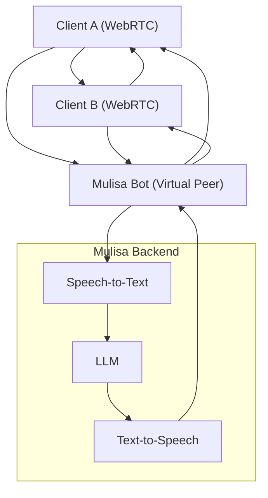
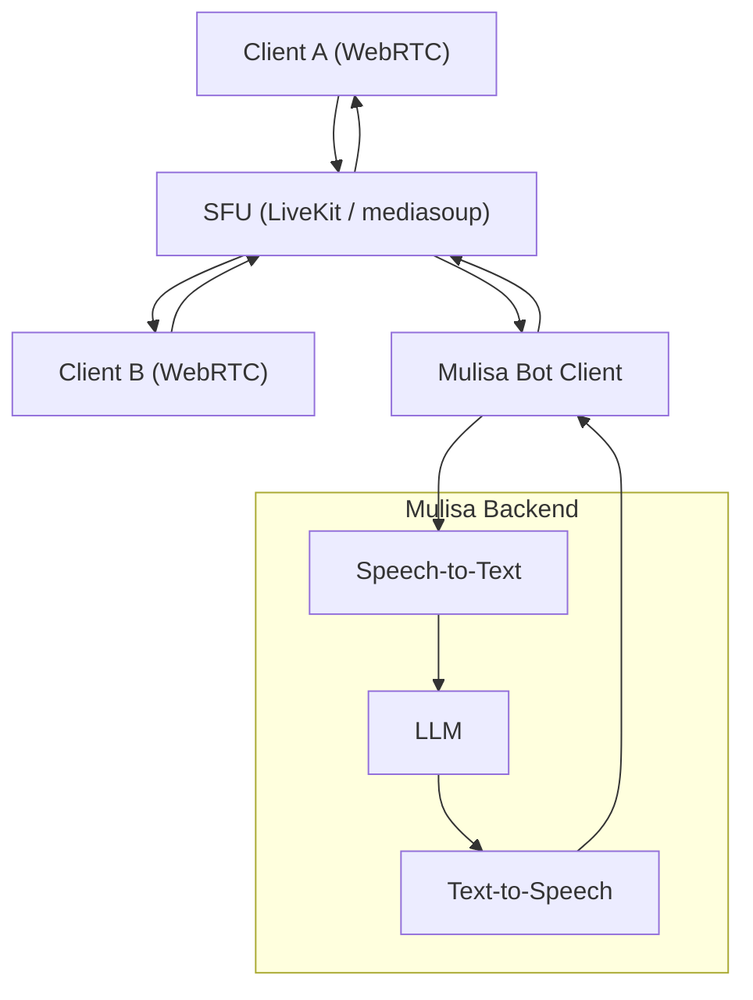

# P2P v.s SFU

## ⚖️ Goal

Compare:

1. **P2P Mesh with Mulisa added**
2. **SFU-Based Call with Mulisa**

And clarify why the SFU model simplifies things, especially for audio routing and scale.

---

### ✅ Option 1: P2P Mesh (WebRTC without SFU)

### 🧠 What’s happening here:

* Full mesh: each peer connects to every other peer
* Each device has to send **two streams** (A → B and A → Mulisa)
* **Re-negotiation** is needed every time someone joins or leaves
* Audio routing: you must control what Mulisa hears and says from each peer manually

### ⚠️ Downsides:

* More complex signaling
* Poor bandwidth efficiency
* Fragile when networks are behind NAT (especially for 3 peers)
* Scaling gets exponentially harder with every new peer

---

### ✅ Option 2: SFU-Based Call

[](https://mermaid.live/edit#pako:eNptkctuwjAQRX_FmhWVAnV45OFFJQLqprApriq16cIkhkQkcZQ4LRTx77WT8IioF_b4-sydGfkIgQg5ENgk4ieIWCERnfsZUmuWxDyT008fmghNUe-dr1_p7MGHr1vGuzLePbN6flPvake9RfzNX2KJHlHKw5iVosqv3LJK4pIptAmQJ2TrXyOdplC__6SNO110xdalo-kmtNC6_Cd6XbFxOVcvq_W2YHl0NvdYsONZ2DzWaZTqWXPOg6gvRZ_yvbwMqNdisVSA2jsqpSulalgnNekXoC5wPxOl9ams6lNZ3DQMBqS8SFkcqq896mQfZMRT7gNRYciKnQ9-dlIcq6RYHbIAiCwqbkAhqm0EZMOSUt2qPGSSz2Om5k7PSM6yDyEu122hy7TZqltezESVSSBujQI5wh7I0DEHeOzgCbZtjK0Rtg04ADGxORg5pmm5pmtPxpZzMuC3NscDe-iajmu5I3do29bYPf0Bu0jKyw)

### 🧠 What’s happening here:

* Each participant connects **only to the SFU**
* SFU forwards streams to the right people:

  * Mulisa receives A and B’s audio for transcription
  * A and B receive Mulisa’s audio (via published track)
* SFU handles routing, stream selection, NAT traversal (with TURN)

### ✅ Advantages:

* Scales easily (1 connection per participant)
* Mulisa can subscribe to both A and B’s audio without custom logic
* Easier audio injection — TTS just publishes 1 stream to SFU
* Clean signaling — no re-negotiation between A and B needed
* SFU can do audio-level forwarding, track-level control, and more

---

## 🏁 Summary

| Feature               | P2P Mesh              | SFU-Based                  |
| --------------------- | --------------------- | -------------------------- |
| Connections per user  | N-1                   | 1                          |
| Bandwidth per user    | High                  | Low                        |
| Ease of adding Mulisa | Hard (multiple peers) | Easy (1 SFU join)          |
| Audio injection (TTS) | Manual and tricky     | Native via published track |
| Stream control        | Manual                | Track subscriptions        |
| Scalability           | Poor beyond 2–3 users | Great                      |

---

Would you like a **visual example of Mulisa publishing an Opus-encoded audio track into the SFU**, or how this ties into the backend streaming APIs like Azure or OpenAI?
