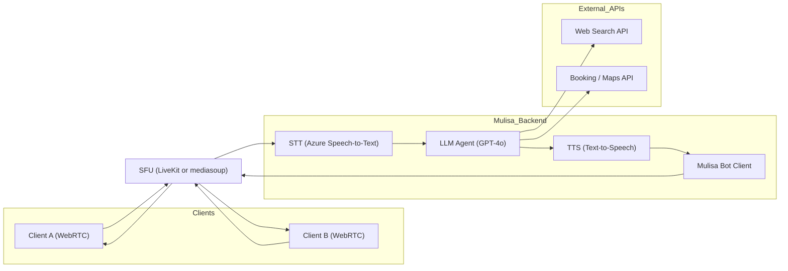

## Selective Forwarding Unit (SFU)

[](https://mermaid.live/edit#pako:eNp9Ul1vmzAU_SuWnzIpZCEhfD1MgmydpiVSVagmtUyVCy6ggI2M2dJG-e-9jiEtWTU_XN17OPfrXA445RnFPn6q-N-0IEKizU3CELy2e8wFaQq0rkrKZKtR9TQQ3CdYeyhAk1_08SZef0rw70te-MYL_-VRliXsouG2q8qWPIQk3Z0-D_WiOIZaYNEkeOkERVFDaVoYkhsx3ctx881mC2SwKMhV78n369iw-JgUxxGQwKKJqqAq6Zpjmh4o5BLI2kcQ9Pv9d5Vve0kFI9VDcP3jnYKgQkSJSAsoCD7SAQLSeDzS7gADUsj5rmQ5-oy2pGlHxHdt-8Mgw_iCoqtbJdbVLZpsyj_0ZykRF6imWUla3jVvC_ZXGpI0qPJOQBz3AKiuABBUA0pZBYB4GlAqKuAslobP4ccN-pE_AsNhraHVWbWLCbRKCcNTXFNRkzKDH_qgSAmWBa1pgn1wMyJ2CU7YEXikkzx6Zin2pejoFAve5QX2n0jVQtQ1GZH0a0ngiPUZbQi747weUnKh-vTpcAQq1rxjEvuue-Ji_4D32DdX1mxuufOVZ9m2tXQWiyl-Btj2ZkvXNO2V65ju3DGXxyl-OZWfz5yFZ7qe7S29hePYlnd8BaUZE0Y)



Exactly — in an **SFU (Selective Forwarding Unit)**-based architecture, **there is no direct peer-to-peer (P2P) connection between A and B**. Instead:

### 📡 All media (audio/video) is routed through the SFU.

---

## 🔁 How It Works (SFU model)

```text
Client A ──┐
           │
        [ SFU ]  ⇐ Mulisa also connects here
           │
Client B ──┘
```

Each participant:

* **Sends** their media stream **to the SFU**
* **Receives** the other participant’s media **from the SFU**

The SFU:

* **Does not process or mix** the media (like an MCU would)
* Simply **forwards** selected media tracks from sender to receivers
* Enables **bandwidth-efficient multiparty calls**

---

## ✅ Benefits of SFU over P2P

| Feature                     | P2P               | SFU                       |
| --------------------------- | ----------------- | ------------------------- |
| Connection type             | Direct (mesh)     | Routed via central SFU    |
| Number of connections       | N×(N−1)/2         | N (1 per client)          |
| Bandwidth efficiency        | Poor at scale     | High                      |
| Multiparty support          | Limited / complex | Native and scalable       |
| Third-party participants    | Hard              | Easy (just join the SFU)  |
| Dynamic join/leave handling | Manual, messy     | SFU handles dynamically   |
| Mobile NAT/firewall issues  | Common            | SFU + TURN solves cleanly |
| Latency                     | Low               | Slightly more, but stable |

---

## 🧠 Why This Matters for Mulisa

Your use case requires:

* A third party to **join or leave dynamically**
* Easy access to **both A and B's audio streams**
* A single point to **inject AI responses as audio**

All of these are **very hard to do with P2P**, and **trivial with an SFU**.

---

Would you like me to show a **side-by-side comparison of signaling + media paths in P2P vs SFU** next?


Excellent. You're right to challenge the tradeoffs — let’s **compare the two architectures** side-by-side using **Mermaid diagrams** and clarify exactly what happens in both cases:

---