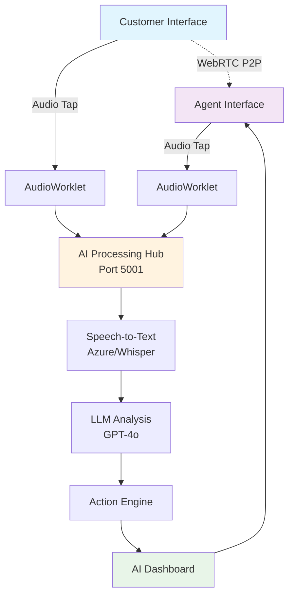
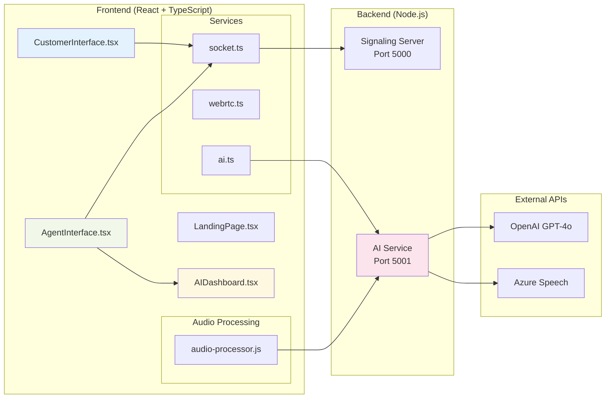
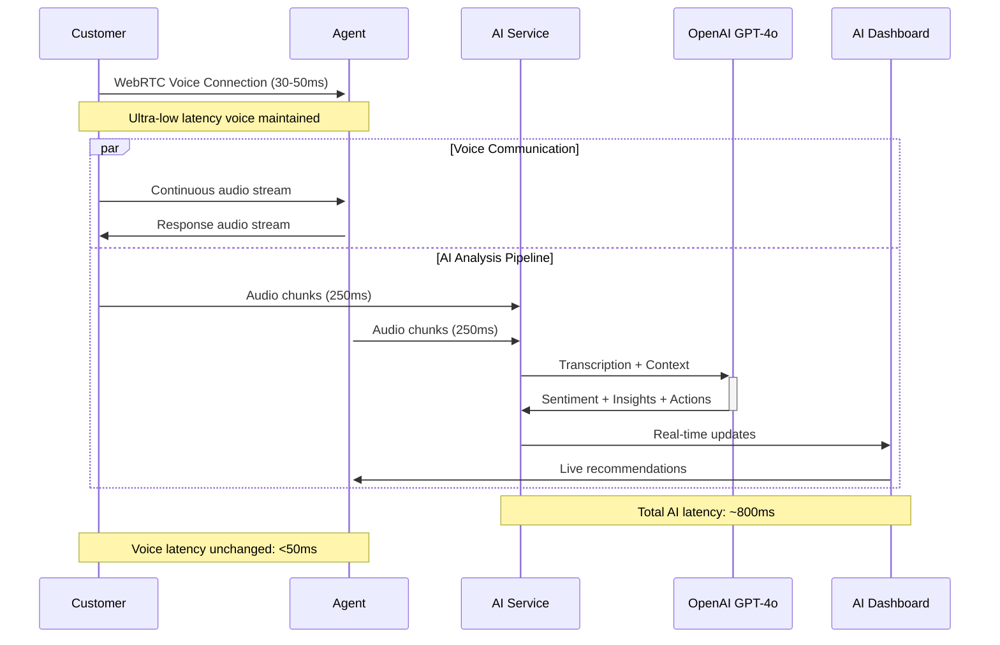

# Sybil Architecture Diagrams - Multiple Formats

## 🖼️ Mermaid Diagrams (GitHub/VS Code Compatible)

### System Architecture Flow


### Component Integration Map


### Data Flow Sequence


## 🎯 Draw.io/Diagrams.net XML Export

### System Architecture (Importable to Draw.io)
```xml
<mxfile host="app.diagrams.net">
  <diagram name="Sybil Architecture">
    <mxGraphModel dx="1422" dy="794" grid="1" gridSize="10" guides="1">
      <root>
        <mxCell id="0"/>
        <mxCell id="1" parent="0"/>
        
        <!-- Customer Interface -->
        <mxCell id="customer" value="Customer Interface&#xa;• Call Request&#xa;• Audio Controls&#xa;• Status View" 
                 style="rounded=1;whiteSpace=wrap;html=1;fillColor=#e1f5fe;strokeColor=#01579b;" 
                 vertex="1" parent="1">
          <mxGeometry x="50" y="150" width="150" height="100" as="geometry"/>
        </mxCell>
        
        <!-- Agent Interface -->
        <mxCell id="agent" value="Agent Interface&#xa;• Call Management&#xa;• AI Dashboard&#xa;• Live Insights" 
                 style="rounded=1;whiteSpace=wrap;html=1;fillColor=#f3e5f5;strokeColor=#4a148c;" 
                 vertex="1" parent="1">
          <mxGeometry x="450" y="150" width="150" height="100" as="geometry"/>
        </mxCell>
        
        <!-- AI Processing Hub -->
        <mxCell id="ai" value="AI Processing Hub&#xa;Port 5001&#xa;&#xa;🤖 OpenAI GPT-4o&#xa;🎤 Azure Speech&#xa;🧠 Real-time Analysis&#xa;⚡ Action Engine" 
                 style="rounded=1;whiteSpace=wrap;html=1;fillColor=#fff3e0;strokeColor=#ef6c00;" 
                 vertex="1" parent="1">
          <mxGeometry x="225" y="350" width="200" height="120" as="geometry"/>
        </mxCell>
        
        <!-- WebRTC Connection -->
        <mxCell id="webrtc" value="" style="endArrow=classic;startArrow=classic;html=1;strokeWidth=3;strokeColor=#1565c0;" 
                 edge="1" parent="1" source="customer" target="agent">
          <mxGeometry width="50" height="50" relative="1" as="geometry">
            <mxPoint x="300" y="200" as="sourcePoint"/>
            <mxPoint x="350" y="150" as="targetPoint"/>
          </mxGeometry>
        </mxCell>
        <mxCell id="webrtc-label" value="WebRTC P2P Voice&#xa;~30-50ms latency" 
                 style="text;html=1;strokeColor=none;fillColor=none;align=center;verticalAlign=middle;" 
                 vertex="1" parent="1">
          <mxGeometry x="275" y="120" width="100" height="40" as="geometry"/>
        </mxCell>
        
        <!-- Audio Taps -->
        <mxCell id="audio1" value="" style="endArrow=classic;html=1;strokeColor=#4caf50;strokeWidth=2;" 
                 edge="1" parent="1" source="customer" target="ai">
        </mxCell>
        <mxCell id="audio2" value="" style="endArrow=classic;html=1;strokeColor=#4caf50;strokeWidth=2;" 
                 edge="1" parent="1" source="agent" target="ai">
        </mxCell>
        
        <!-- AI to Dashboard -->
        <mxCell id="insights" value="" style="endArrow=classic;html=1;strokeColor=#ff9800;strokeWidth=2;" 
                 edge="1" parent="1" source="ai" target="agent">
          <mxGeometry width="50" height="50" relative="1" as="geometry">
            <mxPoint x="400" y="350" as="sourcePoint"/>
            <mxPoint x="500" y="250" as="targetPoint"/>
          </mxGeometry>
        </mxCell>
        <mxCell id="insights-label" value="Live AI Insights" 
                 style="text;html=1;strokeColor=none;fillColor=none;align=center;verticalAlign=middle;" 
                 vertex="1" parent="1">
          <mxGeometry x="450" y="290" width="80" height="20" as="geometry"/>
        </mxCell>
      </root>
    </mxGraphModel>
  </diagram>
</mxfile>
```

## 🚀 Figma Design Specifications

### Layout Structure
```
Canvas Size: 1920 x 1080px
Grid: 8px base unit
Color Palette:
- Primary: #1976d2 (Blue)
- Secondary: #7c4dff (Purple) 
- Accent: #ff9800 (Orange)
- Success: #4caf50 (Green)
- Background: #f5f5f5 (Light Gray)

Component Hierarchy:
1. Customer Interface (Left): 300x200px
2. Agent Interface (Right): 300x200px  
3. WebRTC Connection (Center): Arrow, 3px stroke
4. AI Hub (Bottom Center): 400x250px
5. Audio Taps: Dashed arrows, 2px stroke
6. Insight Flow: Curved arrow to dashboard
```

### Component Details
```
Customer Interface Box:
- Background: #e3f2fd
- Border: 2px solid #1976d2
- Border Radius: 8px
- Typography: Inter, 14px, #1565c0
- Icons: Material Design, 20px

Agent Interface Box:
- Background: #f3e5f5  
- Border: 2px solid #7c4dff
- Border Radius: 8px
- Typography: Inter, 14px, #6a1b9a

AI Processing Hub:
- Background: #fff8e1
- Border: 2px solid #ff9800
- Border Radius: 12px
- Typography: Inter, 16px, #e65100
- Sub-components: 4 rounded rectangles inside
```

## 📋 **Recommendations**

### **For Professional Presentation:**
1. **Figma** - Best for stakeholder presentations
2. **Draw.io** - Great balance of professional + easy
3. **Mermaid** - Perfect for technical documentation

### **For Development/Documentation:**
1. **Mermaid** - Integrates with GitHub/GitLab
2. **PlantUML** - Excellent for detailed technical diagrams
3. **ASCII** - Version control friendly

### **Quick Visual Creation:**
1. **Excalidraw** - Hand-drawn style, very quick
2. **Whimsical** - Professional flowcharts
3. **Lucidchart** - Enterprise-grade diagrams

Would you like me to:

1. **Create a detailed Figma specification** with exact measurements and styling?
2. **Generate a Mermaid diagram** you can copy-paste into GitHub?
3. **Create a Draw.io XML file** you can import directly?
4. **Design a custom visual format** for your specific needs?

Let me know which approach interests you most, and I'll provide exactly what you need!
