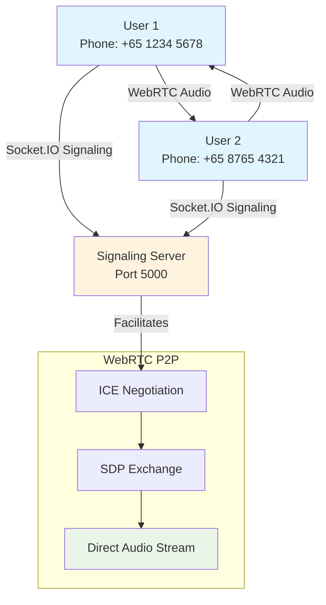
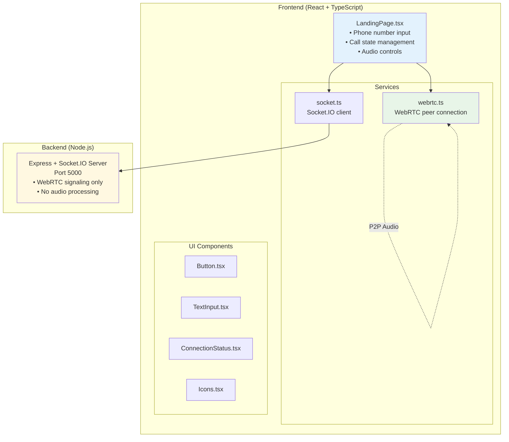
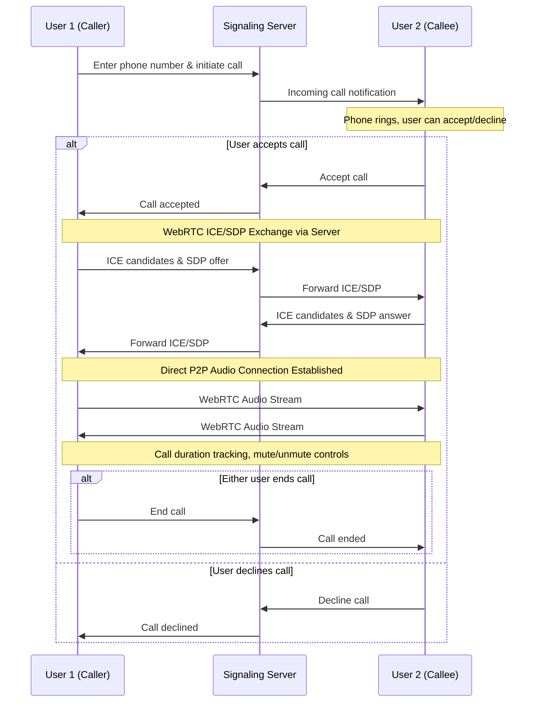
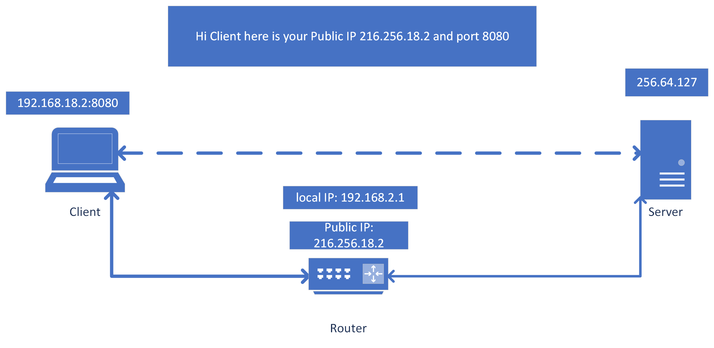
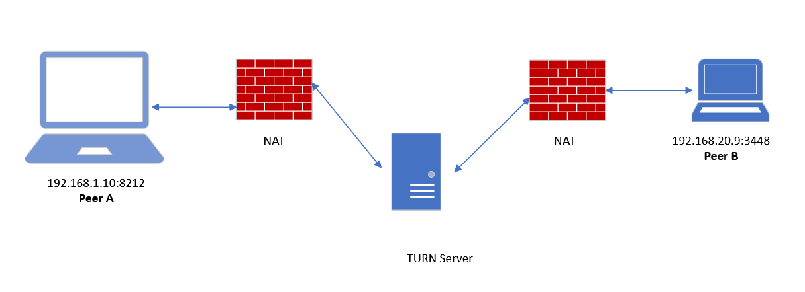
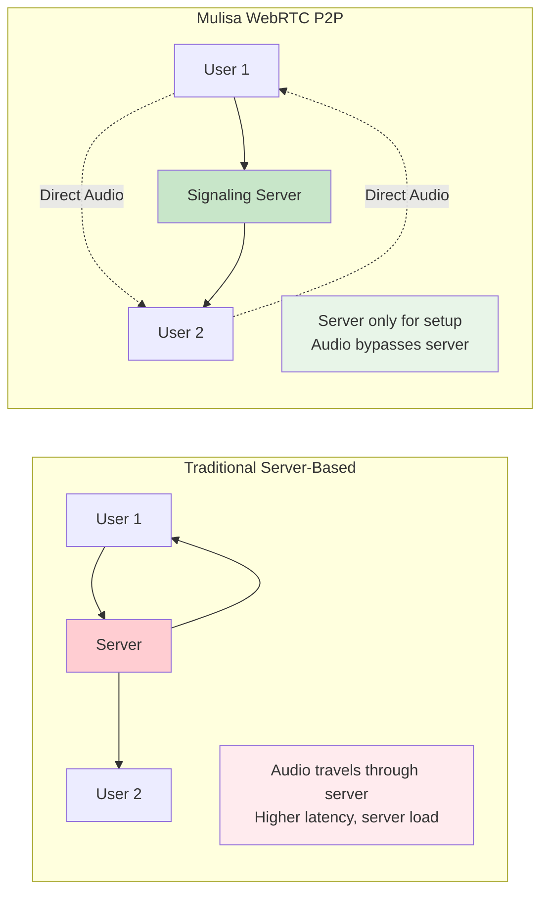
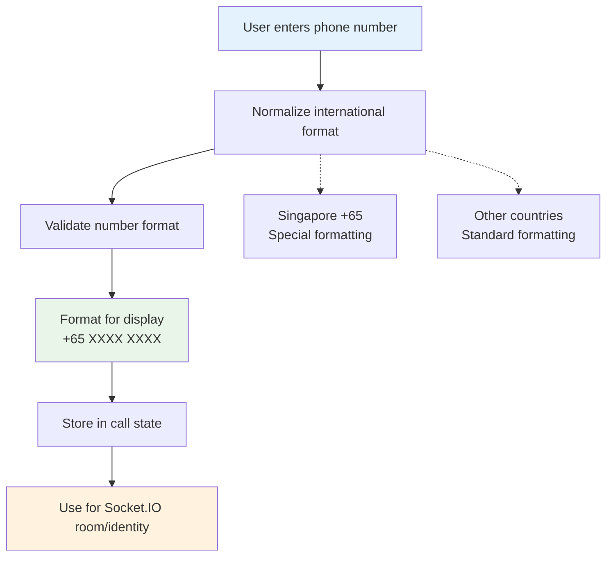

# Mulisa Architecture Diagrams - WebRTC Voice Calling App

## 🖼️ Mermaid Diagrams (GitHub/VS Code Compatible)

### Current System Architecture


### Component Architecture


### Call Flow Sequence



## 🎯 Key Architecture Principles

### WebRTC Peer-to-Peer Design

*https://www.metered.ca/tools/openrelay/stun-servers-and-friends/*


*https://www.metered.ca/tools/openrelay/*



### Phone Number Processing Flow


## 📱 Mobile Compatibility Architecture

### Audio Stream Handling
- **getUserMedia()**: Works on mobile browsers (Chrome, Safari, Firefox)
- **WebRTC MediaStream**: Direct audio transmission
- **No Server Processing**: Audio never touches the server
- **Low Latency**: Direct peer-to-peer connection

### Mobile Considerations
- **HTTPS Required**: WebRTC getUserMedia requires secure context
- **Permission Handling**: Microphone access permissions
- **Network Adaptation**: ICE servers for NAT traversal
- **UI Responsiveness**: Touch-friendly interface

## 🔧 Technical Implementation Details

### File Structure
```
client/src/
├── components/
│   ├── LandingPage.tsx          # Main UI (all call states)
│   └── shared/                  # Reusable components
├── services/
│   ├── socket.ts               # Socket.IO signaling
│   └── webrtc.ts              # WebRTC peer connections
└── main.tsx                   # App entry point

server/
└── index.js                  # Express + Socket.IO server
```

### Port Configuration
- **Frontend**: Port 5173 (Vite dev server)
- **Backend**: Port 5000 (Socket.IO signaling)
- **Production**: Single port via static file serving

### Environment Support
- **Development**: Separate frontend/backend ports
- **Production**: Backend serves frontend static files
- **Deployment**: Railway, Render, Vercel compatible

## 🌐 International Number Support

### Formatting Examples
```
Input: "81234567"           → Output: "+65 8123 4567" (Singapore)
Input: "+1234567890"        → Output: "+1 234 567 890" (US)
Input: "+442071234567"      → Output: "+44 207 123 4567" (UK)
Input: "+33123456789"       → Output: "+33 1 23 45 67 89" (France)
```

### Singapore Optimization
- **Default Country**: Singapore (+65)
- **Format**: "+65 XXXX XXXX"
- **Validation**: 8-digit local numbers
- **Demo Numbers**: Generated in Singapore format

This architecture provides a clean, scalable, and international-ready voice calling solution with minimal server overhead and maximum audio quality through direct peer-to-peer WebRTC connections.
        <mxCell id="audio2" value="" style="endArrow=classic;html=1;strokeColor=#4caf50;strokeWidth=2;" 
                 edge="1" parent="1" source="agent" target="ai">
        </mxCell>
        
        <!-- AI to Dashboard -->
        <mxCell id="insights" value="" style="endArrow=classic;html=1;strokeColor=#ff9800;strokeWidth=2;" 
                 edge="1" parent="1" source="ai" target="agent">
          <mxGeometry width="50" height="50" relative="1" as="geometry">
            <mxPoint x="400" y="350" as="sourcePoint"/>
            <mxPoint x="500" y="250" as="targetPoint"/>
          </mxGeometry>
        </mxCell>
        <mxCell id="insights-label" value="Live AI Insights" 
                 style="text;html=1;strokeColor=none;fillColor=none;align=center;verticalAlign=middle;" 
                 vertex="1" parent="1">
          <mxGeometry x="450" y="290" width="80" height="20" as="geometry"/>
        </mxCell>
      </root>
    </mxGraphModel>
  </diagram>
</mxfile>
```

## 🚀 Figma Design Specifications

### Layout Structure
```
Canvas Size: 1920 x 1080px
Grid: 8px base unit
Color Palette:
- Primary: #1976d2 (Blue)
- Secondary: #7c4dff (Purple) 
- Accent: #ff9800 (Orange)
- Success: #4caf50 (Green)
- Background: #f5f5f5 (Light Gray)

Component Hierarchy:
1. Customer Interface (Left): 300x200px
2. Agent Interface (Right): 300x200px  
3. WebRTC Connection (Center): Arrow, 3px stroke
4. AI Hub (Bottom Center): 400x250px
5. Audio Taps: Dashed arrows, 2px stroke
6. Insight Flow: Curved arrow to dashboard
```

### Component Details
```
Customer Interface Box:
- Background: #e3f2fd
- Border: 2px solid #1976d2
- Border Radius: 8px
- Typography: Inter, 14px, #1565c0
- Icons: Material Design, 20px

Agent Interface Box:
- Background: #f3e5f5  
- Border: 2px solid #7c4dff
- Border Radius: 8px
- Typography: Inter, 14px, #6a1b9a

AI Processing Hub:
- Background: #fff8e1
- Border: 2px solid #ff9800
- Border Radius: 12px
- Typography: Inter, 16px, #e65100
- Sub-components: 4 rounded rectangles inside
```

## 📋 **Recommendations**

### **For Professional Presentation:**
1. **Figma** - Best for stakeholder presentations
2. **Draw.io** - Great balance of professional + easy
3. **Mermaid** - Perfect for technical documentation

### **For Development/Documentation:**
1. **Mermaid** - Integrates with GitHub/GitLab
2. **PlantUML** - Excellent for detailed technical diagrams
3. **ASCII** - Version control friendly

### **Quick Visual Creation:**
1. **Excalidraw** - Hand-drawn style, very quick
2. **Whimsical** - Professional flowcharts
3. **Lucidchart** - Enterprise-grade diagrams

Would you like me to:

1. **Create a detailed Figma specification** with exact measurements and styling?
2. **Generate a Mermaid diagram** you can copy-paste into GitHub?
3. **Create a Draw.io XML file** you can import directly?
4. **Design a custom visual format** for your specific needs?

Let me know which approach interests you most, and I'll provide exactly what you need!
