# Oracle AI Dashboard - Visual Flow Diagrams

## Real-Time Dashboard Component Architecture

```mermaid
graph TB
    subgraph "Dashboard State Management"
        STATE[🗄️ Global State<br/>Redux/Context API<br/>Real-time Updates]
        SOCKET[🔌 Socket Connection<br/>Live Data Stream<br/>Event Handlers]
        CACHE[⚡ Local Cache<br/>Performance Optimization<br/>Offline Support]
    end

    subgraph "Voice & Transcription Panel"
        MIC[🎙️ Microphone Control<br/>Mute/Unmute Toggle<br/>Audio Level Meter]
        TRANS_LIVE[📝 Live Transcription<br/>Real-time Text Stream<br/>Confidence Indicators]
        SPEECH_DETECT[🗣️ Speech Detection<br/>VAD Algorithm<br/>Speaker Identification]
    end

    subgraph "AI Analysis Real-Time Panel"
        SENTIMENT_GAUGE[😊 Sentiment Gauge<br/>Emotional State Tracking<br/>Trend Visualization]
        INTENT_DISPLAY[🎯 Intent Display<br/>Purpose Recognition<br/>Confidence Scoring]
        ENTITY_TAGS[🏷️ Entity Tags<br/>Dynamic Highlighting<br/>Contextual Information]
        CONTEXT_GRAPH[🧠 Context Graph<br/>Conversation Memory<br/>Relationship Mapping]
    end

    subgraph "Oracle Wisdom Panel"
        PROPHECY[🔮 Prophetic Insights<br/>Predictive Analytics<br/>Conversation Guidance]
        GUIDANCE[📜 Wisdom Guidance<br/>Best Practice Suggestions<br/>Cultural Context]
        WARNINGS[⚠️ Oracle Warnings<br/>Risk Indicators<br/>Escalation Alerts]
        SUGGESTIONS[💡 Smart Suggestions<br/>Response Templates<br/>Action Recommendations]
    end

    subgraph "Agentic Action Control Center"
        ACTION_QUEUE[📋 Action Queue<br/>Pending Operations<br/>Priority Sorting]
        APPROVAL_FLOW[🤝 Approval Workflow<br/>Decision Points<br/>Escalation Paths]
        EXECUTION_STATUS[⚙️ Execution Status<br/>Real-time Progress<br/>Success/Failure States]
        MANUAL_OVERRIDE[👤 Manual Override<br/>Agent Control<br/>Custom Actions]
    end

    subgraph "Customer Context Panel"
        PROFILE[👤 Customer Profile<br/>Personal Information<br/>Preference Settings]
        HISTORY[📚 Interaction History<br/>Previous Conversations<br/>Resolution Patterns]
        JOURNEY[🗺️ Customer Journey<br/>Touchpoint Mapping<br/>Experience Timeline]
        SENTIMENT_HISTORY[😊📈 Sentiment Journey<br/>Emotional Progression<br/>Satisfaction Trends]
    end

    subgraph "Performance Analytics Panel"
        KPI_DASHBOARD[📊 KPI Dashboard<br/>Real-time Metrics<br/>Goal Tracking]
        COMPARISON[📈 Performance Comparison<br/>Team Benchmarks<br/>Historical Analysis]
        ALERTS[🚨 Performance Alerts<br/>Threshold Monitoring<br/>Improvement Suggestions]
        COACHING[🎓 AI Coaching<br/>Skill Development<br/>Training Recommendations]
    end

    %% Data Flow Connections
    SOCKET --> STATE
    STATE --> CACHE
    
    SOCKET --> TRANS_LIVE
    TRANS_LIVE --> MIC
    TRANS_LIVE --> SPEECH_DETECT
    
    TRANS_LIVE --> SENTIMENT_GAUGE
    TRANS_LIVE --> INTENT_DISPLAY
    TRANS_LIVE --> ENTITY_TAGS
    INTENT_DISPLAY --> CONTEXT_GRAPH
    
    SENTIMENT_GAUGE --> PROPHECY
    INTENT_DISPLAY --> PROPHECY
    CONTEXT_GRAPH --> GUIDANCE
    PROPHECY --> WARNINGS
    GUIDANCE --> SUGGESTIONS
    
    SUGGESTIONS --> ACTION_QUEUE
    ACTION_QUEUE --> APPROVAL_FLOW
    APPROVAL_FLOW --> EXECUTION_STATUS
    EXECUTION_STATUS --> MANUAL_OVERRIDE
    
    STATE --> PROFILE
    PROFILE --> HISTORY
    HISTORY --> JOURNEY
    JOURNEY --> SENTIMENT_HISTORY
    
    EXECUTION_STATUS --> KPI_DASHBOARD
    KPI_DASHBOARD --> COMPARISON
    COMPARISON --> ALERTS
    ALERTS --> COACHING
    
    COACHING --> SUGGESTIONS
    SENTIMENT_HISTORY --> PROPHECY

    %% Styling
    classDef stateLayer fill:#e1f5fe,stroke:#0277bd,stroke-width:2px
    classDef voiceLayer fill:#f3e5f5,stroke:#7b1fa2,stroke-width:2px
    classDef aiLayer fill:#e8f5e8,stroke:#2e7d32,stroke-width:2px
    classDef oracleLayer fill:#fff3e0,stroke:#ef6c00,stroke-width:2px
    classDef actionLayer fill:#fce4ec,stroke:#c2185b,stroke-width:2px
    classDef contextLayer fill:#f1f8e9,stroke:#689f38,stroke-width:2px
    classDef analyticsLayer fill:#ede7f6,stroke:#512da8,stroke-width:2px
    
    class STATE,SOCKET,CACHE stateLayer
    class MIC,TRANS_LIVE,SPEECH_DETECT voiceLayer
    class SENTIMENT_GAUGE,INTENT_DISPLAY,ENTITY_TAGS,CONTEXT_GRAPH aiLayer
    class PROPHECY,GUIDANCE,WARNINGS,SUGGESTIONS oracleLayer
    class ACTION_QUEUE,APPROVAL_FLOW,EXECUTION_STATUS,MANUAL_OVERRIDE actionLayer
    class PROFILE,HISTORY,JOURNEY,SENTIMENT_HISTORY contextLayer
    class KPI_DASHBOARD,COMPARISON,ALERTS,COACHING analyticsLayer
```

## Interactive Widget State Flow

## Oracle Wisdom Integration Flow

```mermaid
sequenceDiagram
    participant Agent as 👨‍💼 Agent
    participant Dashboard as 🖥️ Dashboard
    participant Oracle as 🔮 Oracle Wisdom
    participant AI as 🤖 AI Analysis
    participant Customer as 🙋 Customer

    Note over Agent,Customer: Oracle-Enhanced Conversation Flow

    Customer->>Dashboard: 🗣️ "I'm really frustrated with this order delay"
    Dashboard->>AI: 📝 Transcribe & Analyze
    AI->>AI: 🎯 Intent: complaint_order_delay<br/>😤 Sentiment: frustrated (85%)<br/>🏷️ Entity: order_delay

    AI->>Oracle: 🔮 Request wisdom consultation
    Note over Oracle: Prophetic Analysis in Progress
    Oracle->>Oracle: 📊 Historical pattern recognition<br/>🎭 Cultural context analysis<br/>⚡ Predictive modeling

    Oracle->>Dashboard: 💡 Wisdom Insights
    Note right of Dashboard: "Customer shows escalation risk.<br/>Recommend immediate empathy + solution.<br/>87% chance of retention if handled well."

    Dashboard->>Agent: 📱 Display Oracle Guidance
    Agent->>Dashboard: 👁️ Review insights
    
    Oracle->>Dashboard: 📜 Suggested Response Template
    Note right of Dashboard: "I completely understand your frustration,<br/>and I'm here to make this right for you.<br/>Let me check your order immediately."

    Agent->>Customer: 🗣️ Empathetic response
    Customer->>Dashboard: 🗣️ "Thank you, I appreciate that"
    
    Dashboard->>AI: 📝 Sentiment shift analysis
    AI->>Oracle: 😊 Sentiment: grateful (70%) - Improving trend
    Oracle->>Dashboard: ✅ Prophecy fulfilled: De-escalation successful
    
    Oracle->>Dashboard: 🎯 Next Action Guidance
    Note right of Dashboard: "Proactively offer compensation<br/>before customer asks.<br/>Builds loyalty and trust."

    Dashboard->>Agent: 💡 Proactive suggestion
    Agent->>Customer: 🗣️ "I'd like to offer you expedited shipping at no charge"
    Customer->>Dashboard: 🗣️ "That would be wonderful, thank you!"
    
    Oracle->>Oracle: 📚 Learn successful pattern
    Oracle->>Dashboard: 🏆 Interaction success logged
```

## Dashboard Layout & Component Positioning

```mermaid
graph TB
    subgraph "Oracle AI Dashboard Layout - 1920x1080"
        subgraph "Top Navigation Bar - 1920x60"
            LOGO[🔮 Sybil Oracle]
            STATUS[🟢 Connected]
            TIME[⏱️ 08:45]
            AGENT_INFO[👨‍💼 Agent: John Smith]
        end
        
        subgraph "Main Dashboard Area - 1920x900"
            subgraph "Left Panel - 480x900"
                subgraph "Customer Context - 480x300"
                    CUSTOMER_CARD[👤 Customer Profile<br/>📊 Quick Stats<br/>📚 Recent History]
                end
                
                subgraph "Oracle Wisdom - 480x300"
                    ORACLE_INSIGHTS[🔮 Prophetic Insights<br/>📜 Guidance Text<br/>⚠️ Warnings & Alerts]
                end
                
                subgraph "Performance - 480x300"
                    METRICS[📊 Live Metrics<br/>🎯 Daily Goals<br/>📈 Trends]
                end
            end
            
            subgraph "Center Panel - 960x900"
                subgraph "Voice Controls - 960x100"
                    MIC_CTRL[🎙️ Microphone<br/>🔊 Volume<br/>📞 Call Controls]
                end
                
                subgraph "Live Transcription - 960x400"
                    TRANSCRIPT[📝 Real-time Conversation<br/>🗣️ Speaker Labels<br/>⚡ Confidence Scores]
                end
                
                subgraph "AI Analysis - 960x400"
                    AI_INSIGHTS[🧠 Intent & Entities<br/>😊 Sentiment Analysis<br/>🎯 Context Understanding]
                end
            end
            
            subgraph "Right Panel - 480x900"
                subgraph "Action Queue - 480x300"
                    ACTIONS[📋 Pending Actions<br/>⚙️ Execution Status<br/>✅ Completed Tasks]
                end
                
                subgraph "Approval Center - 480x300"
                    APPROVALS[🤝 Approval Requests<br/>⚖️ Risk Assessment<br/>👨‍💼 Escalations]
                end
                
                subgraph "Quick Actions - 480x300"
                    QUICK_ACTIONS[⚡ Common Actions<br/>📧 Send Email<br/>🎫 Create Ticket<br/>📞 Transfer Call]
                end
            end
        end
        
        subgraph "Bottom Status Bar - 1920x120"
            CONNECTION_STATUS[📡 WebRTC: Connected<br/>🔌 Socket.IO: Active<br/>🤖 AI: Processing]
            ORACLE_STATUS[🔮 Oracle: Consulted 12 times<br/>💡 Accuracy: 94%<br/>⚡ Response: 0.8s avg]
            SYSTEM_STATUS[💾 Memory: 2.1GB<br/>🌐 Network: 98ms<br/>⚡ CPU: 23%]
        end
    end

    %% Component Relationships
    CUSTOMER_CARD -.-> ORACLE_INSIGHTS
    ORACLE_INSIGHTS -.-> AI_INSIGHTS
    AI_INSIGHTS -.-> ACTIONS
    ACTIONS -.-> APPROVALS
    TRANSCRIPT -.-> AI_INSIGHTS
    MIC_CTRL -.-> TRANSCRIPT

    %% Styling
    classDef navigation fill:#1e3a8a,color:#ffffff,stroke:#1e40af
    classDef leftPanel fill:#dcfce7,stroke:#16a34a
    classDef centerPanel fill:#dbeafe,stroke:#2563eb
    classDef rightPanel fill:#fef3c7,stroke:#d97706
    classDef statusBar fill:#f3e8ff,stroke:#9333ea
    
    class LOGO,STATUS,TIME,AGENT_INFO navigation
    class CUSTOMER_CARD,ORACLE_INSIGHTS,METRICS leftPanel
    class MIC_CTRL,TRANSCRIPT,AI_INSIGHTS centerPanel
    class ACTIONS,APPROVALS,QUICK_ACTIONS rightPanel
    class CONNECTION_STATUS,ORACLE_STATUS,SYSTEM_STATUS statusBar
```

## Responsive Design Breakpoints

```mermaid
graph LR
    subgraph "Desktop Layout - 1920x1080+"
        DESKTOP[🖥️ Full Dashboard<br/>3-Panel Layout<br/>All Features Visible]
    end
    
    subgraph "Laptop Layout - 1366x768"
        LAPTOP[💻 Compact Dashboard<br/>Collapsible Panels<br/>Priority Focus]
    end
    
    subgraph "Tablet Layout - 768x1024"
        TABLET[📱 Tabbed Interface<br/>Swipe Navigation<br/>Essential Features]
    end
    
    subgraph "Mobile Layout - 375x667"
        MOBILE[📱 Single Panel View<br/>Bottom Navigation<br/>Voice-First Design]
    end

    DESKTOP -->|Screen < 1920px| LAPTOP
    LAPTOP -->|Screen < 1366px| TABLET
    TABLET -->|Screen < 768px| MOBILE

    subgraph "Adaptive Features"
        AUTO_HIDE[👁️ Auto-hide Panels<br/>Smart Prioritization<br/>Context Awareness]
        VOICE_FIRST[🎙️ Voice-First Mobile<br/>Minimal Visual<br/>Audio Feedback]
        GESTURE[👆 Touch Gestures<br/>Swipe Navigation<br/>Long Press Actions]
    end

    LAPTOP -.-> AUTO_HIDE
    TABLET -.-> GESTURE
    MOBILE -.-> VOICE_FIRST
```

## Implementation Notes

### Key Features

1. **Real-time Updates**: All dashboard components update in real-time via Socket.IO
2. **Oracle Integration**: Wisdom insights prominently displayed and continuously updated
3. **Contextual Awareness**: Customer profile and history inform all AI decisions
4. **Action-Oriented**: Clear pathways for agent decision-making and action execution
5. **Performance Monitoring**: Live metrics and coaching feedback for continuous improvement

### Technical Stack

- **Frontend**: React 18 with TypeScript, Tailwind CSS for styling
- **State Management**: Redux Toolkit with RTK Query for API integration
- **Real-time**: Socket.IO client for live data streams
- **Charts**: Chart.js or D3.js for analytics visualizations
- **Responsive**: CSS Grid and Flexbox for adaptive layouts
- **Accessibility**: ARIA labels, keyboard navigation, screen reader support

### Oracle Wisdom Integration

- **Predictive Analytics**: Machine learning models provide conversation insights
- **Cultural Context**: Understanding of cultural nuances and communication styles
- **Best Practices**: Curated knowledge base of successful interaction patterns
- **Continuous Learning**: Feedback loops improve oracle accuracy over time
