# Sybil Oracle AI - UI Component Architecture

## Component Hierarchy & Mapping

```mermaid
graph TB
    subgraph "Root Application"
        APP[🔮 SybilApp<br/>Main Application Container]
        ROUTER[🛤️ Router<br/>Navigation Management]
        THEME[🎨 ThemeProvider<br/>Design System]
    end

    subgraph "Layout Components"
        LAYOUT[📐 DashboardLayout<br/>Main Layout Container]
        HEADER[🎯 HeaderBar<br/>Navigation & Status]
        SIDEBAR[📋 Sidebar<br/>Navigation Menu]
        MAIN[🖥️ MainContent<br/>Primary Content Area]
        FOOTER[📊 StatusFooter<br/>System Status]
    end

    subgraph "Voice Interface Components"
        VOICE_PANEL[🎙️ VoicePanel<br/>Audio Controls Container]
        MIC_CONTROL[🎤 MicrophoneControl<br/>Mute/Unmute Button]
        AUDIO_METER[📊 AudioMeter<br/>Volume Visualization]
        CALL_CONTROLS[📞 CallControls<br/>Start/End/Transfer]
        CONNECTION_STATUS[🔗 ConnectionStatus<br/>WebRTC Status Indicator]
    end

    subgraph "Transcription Components"
        TRANSCRIPT_PANEL[📝 TranscriptionPanel<br/>Live Text Container]
        LIVE_TRANSCRIPT[⚡ LiveTranscript<br/>Real-time Text Stream]
        SPEAKER_LABEL[👤 SpeakerLabel<br/>Customer/Agent Indicator]
        CONFIDENCE_METER[📊 ConfidenceMeter<br/>Transcription Accuracy]
        TRANSCRIPT_HISTORY[📚 TranscriptHistory<br/>Conversation Log]
    end

    subgraph "AI Analysis Components"
        AI_PANEL[🧠 AIAnalysisPanel<br/>Intelligence Container]
        SENTIMENT_WIDGET[😊 SentimentWidget<br/>Emotion Display]
        INTENT_DISPLAY[🎯 IntentDisplay<br/>Purpose Recognition]
        ENTITY_TAGS[🏷️ EntityTags<br/>Extracted Information]
        CONTEXT_GRAPH[🔗 ContextGraph<br/>Relationship Visualization]
    end

    subgraph "Oracle Wisdom Components"
        ORACLE_PANEL[🔮 OraclePanel<br/>Wisdom Container]
        PROPHECY_DISPLAY[✨ ProphecyDisplay<br/>Predictive Insights]
        WISDOM_TEXT[📜 WisdomText<br/>Guidance Messages]
        WARNING_ALERTS[⚠️ WarningAlerts<br/>Risk Indicators]
        SUGGESTION_CARDS[💡 SuggestionCards<br/>Action Recommendations]
    end

    subgraph "Action Management Components"
        ACTION_PANEL[⚙️ ActionPanel<br/>Action Container]
        ACTION_QUEUE[📋 ActionQueue<br/>Pending Actions List]
        APPROVAL_WIDGET[🤝 ApprovalWidget<br/>Decision Interface]
        EXECUTION_STATUS[⚡ ExecutionStatus<br/>Progress Tracking]
        MANUAL_ACTIONS[👤 ManualActions<br/>Agent Controls]
    end

    subgraph "Customer Context Components"
        CUSTOMER_PANEL[👤 CustomerPanel<br/>Profile Container]
        PROFILE_CARD[📇 ProfileCard<br/>Customer Information]
        HISTORY_TIMELINE[📚 HistoryTimeline<br/>Interaction History]
        JOURNEY_MAP[🗺️ JourneyMap<br/>Experience Tracking]
        SATISFACTION_METER[😊 SatisfactionMeter<br/>Happiness Gauge]
    end

    subgraph "Performance Components"
        METRICS_PANEL[📊 MetricsPanel<br/>Analytics Container]
        KPI_DASHBOARD[🎯 KPIDashboard<br/>Key Performance Indicators]
        GOAL_TRACKER[🏆 GoalTracker<br/>Daily Objectives]
        COMPARISON_CHART[📈 ComparisonChart<br/>Performance Trends]
        COACHING_TIPS[🎓 CoachingTips<br/>Improvement Suggestions]
    end

    subgraph "Shared UI Components"
        BUTTON[🔘 Button<br/>Interactive Element]
        CARD[🃏 Card<br/>Content Container]
        MODAL[🪟 Modal<br/>Dialog Window]
        TOOLTIP[💬 Tooltip<br/>Contextual Help]
        SPINNER[⏳ Spinner<br/>Loading Indicator]
        ICON[🎭 Icon<br/>Visual Symbol]
    end

    %% Component Relationships
    APP --> ROUTER
    APP --> THEME
    ROUTER --> LAYOUT
    
    LAYOUT --> HEADER
    LAYOUT --> SIDEBAR
    LAYOUT --> MAIN
    LAYOUT --> FOOTER
    
    MAIN --> VOICE_PANEL
    MAIN --> TRANSCRIPT_PANEL
    MAIN --> AI_PANEL
    MAIN --> ORACLE_PANEL
    MAIN --> ACTION_PANEL
    MAIN --> CUSTOMER_PANEL
    MAIN --> METRICS_PANEL
    
    VOICE_PANEL --> MIC_CONTROL
    VOICE_PANEL --> AUDIO_METER
    VOICE_PANEL --> CALL_CONTROLS
    VOICE_PANEL --> CONNECTION_STATUS
    
    TRANSCRIPT_PANEL --> LIVE_TRANSCRIPT
    TRANSCRIPT_PANEL --> SPEAKER_LABEL
    TRANSCRIPT_PANEL --> CONFIDENCE_METER
    TRANSCRIPT_PANEL --> TRANSCRIPT_HISTORY
    
    AI_PANEL --> SENTIMENT_WIDGET
    AI_PANEL --> INTENT_DISPLAY
    AI_PANEL --> ENTITY_TAGS
    AI_PANEL --> CONTEXT_GRAPH
    
    ORACLE_PANEL --> PROPHECY_DISPLAY
    ORACLE_PANEL --> WISDOM_TEXT
    ORACLE_PANEL --> WARNING_ALERTS
    ORACLE_PANEL --> SUGGESTION_CARDS
    
    ACTION_PANEL --> ACTION_QUEUE
    ACTION_PANEL --> APPROVAL_WIDGET
    ACTION_PANEL --> EXECUTION_STATUS
    ACTION_PANEL --> MANUAL_ACTIONS
    
    CUSTOMER_PANEL --> PROFILE_CARD
    CUSTOMER_PANEL --> HISTORY_TIMELINE
    CUSTOMER_PANEL --> JOURNEY_MAP
    CUSTOMER_PANEL --> SATISFACTION_METER
    
    METRICS_PANEL --> KPI_DASHBOARD
    METRICS_PANEL --> GOAL_TRACKER
    METRICS_PANEL --> COMPARISON_CHART
    METRICS_PANEL --> COACHING_TIPS

    %% Styling
    classDef rootLayer fill:#1e1b4b,color:#ffffff,stroke:#3730a3
    classDef layoutLayer fill:#064e3b,color:#ffffff,stroke:#059669
    classDef voiceLayer fill:#7c2d12,color:#ffffff,stroke:#ea580c
    classDef transcriptLayer fill:#581c87,color:#ffffff,stroke:#8b5cf6
    classDef aiLayer fill:#1e40af,color:#ffffff,stroke:#3b82f6
    classDef oracleLayer fill:#7c1d6f,color:#ffffff,stroke:#c026d3
    classDef actionLayer fill:#be185d,color:#ffffff,stroke:#ec4899
    classDef customerLayer fill:#166534,color:#ffffff,stroke:#22c55e
    classDef metricsLayer fill:#a16207,color:#ffffff,stroke:#eab308
    classDef sharedLayer fill:#374151,color:#ffffff,stroke:#6b7280
    
    class APP,ROUTER,THEME rootLayer
    class LAYOUT,HEADER,SIDEBAR,MAIN,FOOTER layoutLayer
    class VOICE_PANEL,MIC_CONTROL,AUDIO_METER,CALL_CONTROLS,CONNECTION_STATUS voiceLayer
    class TRANSCRIPT_PANEL,LIVE_TRANSCRIPT,SPEAKER_LABEL,CONFIDENCE_METER,TRANSCRIPT_HISTORY transcriptLayer
    class AI_PANEL,SENTIMENT_WIDGET,INTENT_DISPLAY,ENTITY_TAGS,CONTEXT_GRAPH aiLayer
    class ORACLE_PANEL,PROPHECY_DISPLAY,WISDOM_TEXT,WARNING_ALERTS,SUGGESTION_CARDS oracleLayer
    class ACTION_PANEL,ACTION_QUEUE,APPROVAL_WIDGET,EXECUTION_STATUS,MANUAL_ACTIONS actionLayer
    class CUSTOMER_PANEL,PROFILE_CARD,HISTORY_TIMELINE,JOURNEY_MAP,SATISFACTION_METER customerLayer
    class METRICS_PANEL,KPI_DASHBOARD,GOAL_TRACKER,COMPARISON_CHART,COACHING_TIPS metricsLayer
    class BUTTON,CARD,MODAL,TOOLTIP,SPINNER,ICON sharedLayer
```



## Component State Management Flow

```mermaid
graph TB
    subgraph "Global State Store"
        STORE[🗄️ Redux Store<br/>Central State Management]
        
        subgraph "State Slices"
            CALL_STATE[📞 Call State<br/>Connection Status<br/>Participants]
            TRANSCRIPT_STATE[📝 Transcript State<br/>Live Text<br/>History]
            AI_STATE[🧠 AI State<br/>Analysis Results<br/>Insights]
            ORACLE_STATE[🔮 Oracle State<br/>Wisdom Data<br/>Predictions]
            ACTION_STATE[⚙️ Action State<br/>Pending Actions<br/>Execution Status]
            CUSTOMER_STATE[👤 Customer State<br/>Profile Data<br/>History]
            UI_STATE[🖥️ UI State<br/>Panel Visibility<br/>Themes]
        end
    end

    subgraph "Real-time Data Sources"
        SOCKET[🔌 Socket.IO<br/>Live Data Stream]
        WEBRTC[📡 WebRTC<br/>Audio Stream]
        AI_SERVICE[🤖 AI Service<br/>Analysis Pipeline]
        MCP_SERVICE[⚙️ MCP Service<br/>Tool Execution]
    end

    subgraph "Component Subscriptions"
        VOICE_SUBS[🎙️ Voice Components<br/>Call State Subscribers]
        TRANSCRIPT_SUBS[📝 Transcript Components<br/>Text State Subscribers]
        AI_SUBS[🧠 AI Components<br/>Analysis Subscribers]
        ORACLE_SUBS[🔮 Oracle Components<br/>Wisdom Subscribers]
        ACTION_SUBS[⚙️ Action Components<br/>Execution Subscribers]
    end

    %% Data Flow
    SOCKET --> CALL_STATE
    SOCKET --> TRANSCRIPT_STATE
    SOCKET --> AI_STATE
    SOCKET --> ORACLE_STATE
    SOCKET --> ACTION_STATE
    
    WEBRTC --> CALL_STATE
    AI_SERVICE --> AI_STATE
    AI_SERVICE --> ORACLE_STATE
    MCP_SERVICE --> ACTION_STATE
    
    CALL_STATE --> VOICE_SUBS
    TRANSCRIPT_STATE --> TRANSCRIPT_SUBS
    AI_STATE --> AI_SUBS
    ORACLE_STATE --> ORACLE_SUBS
    ACTION_STATE --> ACTION_SUBS
    
    VOICE_SUBS --> CALL_STATE
    TRANSCRIPT_SUBS --> TRANSCRIPT_STATE
    AI_SUBS --> AI_STATE
    ORACLE_SUBS --> ORACLE_STATE
    ACTION_SUBS --> ACTION_STATE

    %% Styling
    classDef storeLayer fill:#1e3a8a,color:#ffffff,stroke:#1e40af
    classDef dataLayer fill:#059669,color:#ffffff,stroke:#10b981
    classDef componentLayer fill:#7c2d12,color:#ffffff,stroke:#ea580c
    
    class STORE,CALL_STATE,TRANSCRIPT_STATE,AI_STATE,ORACLE_STATE,ACTION_STATE,CUSTOMER_STATE,UI_STATE storeLayer
    class SOCKET,WEBRTC,AI_SERVICE,MCP_SERVICE dataLayer
    class VOICE_SUBS,TRANSCRIPT_SUBS,AI_SUBS,ORACLE_SUBS,ACTION_SUBS componentLayer
```



## Interactive Component Event Flow

```mermaid
sequenceDiagram
    participant User as 👨‍💼 Agent User
    participant UI as 🖥️ UI Component
    participant State as 🗄️ State Store
    participant Socket as 🔌 Socket.IO
    participant AI as 🤖 AI Service
    participant Oracle as 🔮 Oracle Wisdom

    Note over User,Oracle: User Interaction Flow

    User->>UI: 🖱️ Click "Start Call"
    UI->>State: 📞 Dispatch startCall()
    State->>Socket: 🔌 Emit 'call:start'
    Socket->>State: 📡 Connection established
    State->>UI: 🔄 Update call status
    UI->>User: 🟢 Show "Connected"

    User->>UI: 🎙️ Start speaking
    UI->>State: 📝 Dispatch updateTranscript()
    State->>AI: 🧠 Send text for analysis
    AI->>State: 📊 Return analysis results
    State->>Oracle: 🔮 Request wisdom consultation
    Oracle->>State: 💡 Return insights
    State->>UI: 🔄 Update all panels
    UI->>User: 📱 Show live updates

    User->>UI: ✅ Approve action
    UI->>State: ⚙️ Dispatch approveAction()
    State->>Socket: 📡 Emit 'action:approve'
    Socket->>State: ✅ Action executed
    State->>UI: 🔄 Update action status
    UI->>User: 🎉 Show success message

    Note over User,Oracle: Continuous real-time updates via Socket.IO and state subscriptions
```



## Responsive Design Component Adaptation

```mermaid
graph TB
    subgraph "Desktop Layout (1920px+)"
        DESKTOP_GRID[🖥️ CSS Grid Layout<br/>3-Column Design<br/>All Panels Visible]
        
        subgraph "Desktop Panels"
            D_LEFT[👤 Customer Context<br/>🔮 Oracle Wisdom<br/>📊 Performance]
            D_CENTER[🎙️ Voice Controls<br/>📝 Live Transcription<br/>🧠 AI Analysis]
            D_RIGHT[⚙️ Action Queue<br/>🤝 Approvals<br/>⚡ Quick Actions]
        end
    end

    subgraph "Laptop Layout (1366px)"
        LAPTOP_GRID[💻 Flexbox Layout<br/>Collapsible Panels<br/>Priority Focus]
        
        subgraph "Laptop Panels"
            L_MAIN[📝 Primary Content<br/>🧠 AI Analysis<br/>⚙️ Actions]
            L_SIDE[👤 Customer Info<br/>🔮 Oracle Insights<br/>📊 Quick Metrics]
        end
    end

    subgraph "Tablet Layout (768px)"
        TABLET_GRID[📱 Tab Interface<br/>Swipe Navigation<br/>Modal Overlays]
        
        subgraph "Tablet Views"
            T_VOICE[🎙️ Voice Tab<br/>Primary Controls]
            T_ANALYSIS[🧠 Analysis Tab<br/>AI Insights]
            T_CUSTOMER[👤 Customer Tab<br/>Profile & History]
            T_ACTIONS[⚙️ Actions Tab<br/>Pending Tasks]
        end
    end

    subgraph "Mobile Layout (375px)"
        MOBILE_GRID[📱 Single Column<br/>Bottom Navigation<br/>Voice-First]
        
        subgraph "Mobile Views"
            M_VOICE[🎙️ Voice Interface<br/>Minimal Visual<br/>Audio Feedback]
            M_QUICK[⚡ Quick Actions<br/>Essential Controls]
            M_OVERLAY[🪟 Info Overlays<br/>Context on Demand]
        end
    end

    %% Responsive Transitions
    DESKTOP_GRID -->|Screen < 1920px| LAPTOP_GRID
    LAPTOP_GRID -->|Screen < 1366px| TABLET_GRID
    TABLET_GRID -->|Screen < 768px| MOBILE_GRID

    %% Component Adaptation
    D_LEFT -.-> L_SIDE
    D_CENTER -.-> L_MAIN
    D_RIGHT -.-> L_MAIN
    
    L_MAIN -.-> T_VOICE
    L_MAIN -.-> T_ANALYSIS
    L_SIDE -.-> T_CUSTOMER
    L_MAIN -.-> T_ACTIONS
    
    T_VOICE -.-> M_VOICE
    T_ANALYSIS -.-> M_OVERLAY
    T_CUSTOMER -.-> M_OVERLAY
    T_ACTIONS -.-> M_QUICK

    %% Styling
    classDef desktopLayer fill:#1e40af,color:#ffffff,stroke:#3b82f6
    classDef laptopLayer fill:#059669,color:#ffffff,stroke:#10b981
    classDef tabletLayer fill:#dc2626,color:#ffffff,stroke:#ef4444
    classDef mobileLayer fill:#7c2d12,color:#ffffff,stroke:#ea580c
    
    class DESKTOP_GRID,D_LEFT,D_CENTER,D_RIGHT desktopLayer
    class LAPTOP_GRID,L_MAIN,L_SIDE laptopLayer
    class TABLET_GRID,T_VOICE,T_ANALYSIS,T_CUSTOMER,T_ACTIONS tabletLayer
    class MOBILE_GRID,M_VOICE,M_QUICK,M_OVERLAY mobileLayer
```



## Component Performance Optimization

```mermaid
graph TB
    subgraph "Performance Strategies"
        subgraph "React Optimization"
            MEMO[⚡ React.memo<br/>Component Memoization<br/>Prevent Unnecessary Renders]
            CALLBACK[🔗 useCallback<br/>Function Memoization<br/>Stable References]
            EFFECT[🎯 useEffect<br/>Dependency Optimization<br/>Cleanup Functions]
            LAZY[📦 React.lazy<br/>Code Splitting<br/>Dynamic Imports]
        end
        
        subgraph "State Optimization"
            SELECTOR[🎯 useSelector<br/>Precise Subscriptions<br/>Minimal Re-renders]
            NORMALIZE[📊 Normalized State<br/>Flat Data Structure<br/>Efficient Updates]
            BATCH[📦 Batch Updates<br/>Combined Dispatches<br/>Reduced Renders]
        end
        
        subgraph "Data Optimization"
            VIRTUAL[📜 Virtual Scrolling<br/>Large Lists<br/>Memory Efficiency]
            DEBOUNCE[⏱️ Debounced Updates<br/>Input Throttling<br/>API Rate Limiting]
            CACHE[💾 Smart Caching<br/>Response Memoization<br/>Background Sync]
        end
    end

    subgraph "Component Examples"
        TRANSCRIPT_COMP[📝 TranscriptComponent<br/>Virtual scrolling for history<br/>Debounced text updates]
        AI_COMP[🧠 AIAnalysisComponent<br/>Memoized visualization<br/>Selective re-renders]
        ORACLE_COMP[🔮 OracleComponent<br/>Cached wisdom responses<br/>Lazy insight loading]
        ACTION_COMP[⚙️ ActionComponent<br/>Batched status updates<br/>Optimistic UI]
    end

    %% Optimization Applications
    MEMO -.-> TRANSCRIPT_COMP
    VIRTUAL -.-> TRANSCRIPT_COMP
    DEBOUNCE -.-> TRANSCRIPT_COMP
    
    CALLBACK -.-> AI_COMP
    SELECTOR -.-> AI_COMP
    NORMALIZE -.-> AI_COMP
    
    LAZY -.-> ORACLE_COMP
    CACHE -.-> ORACLE_COMP
    EFFECT -.-> ORACLE_COMP
    
    BATCH -.-> ACTION_COMP
    SELECTOR -.-> ACTION_COMP
    MEMO -.-> ACTION_COMP

    %% Styling
    classDef reactOpt fill:#61dafb,color:#000000,stroke:#20232a
    classDef stateOpt fill:#764abc,color:#ffffff,stroke:#593d88
    classDef dataOpt fill:#ff6b6b,color:#ffffff,stroke:#ee5a24
    classDef componentLayer fill:#4ecdc4,color:#000000,stroke:#26d0ce
    
    class MEMO,CALLBACK,EFFECT,LAZY reactOpt
    class SELECTOR,NORMALIZE,BATCH stateOpt
    class VIRTUAL,DEBOUNCE,CACHE dataOpt
    class TRANSCRIPT_COMP,AI_COMP,ORACLE_COMP,ACTION_COMP componentLayer
```



## Implementation Guidelines

### Component Structure

Each component follows a consistent structure:

```typescript
// Component Template Structure
interface ComponentProps {
  // Props definition with TypeScript
}

interface ComponentState {
  // Local state definition
}

const Component: React.FC<ComponentProps> = ({
  // Destructured props
}) => {
  // Hooks (useState, useEffect, useSelector, etc.)
  // Event handlers
  // Computed values
  // Render logic with JSX
  
  return (
    <div className="component-container">
      {/* Component JSX */}
    </div>
  );
};

export default React.memo(Component);
```

### Styling Conventions

- **Tailwind CSS**: Utility-first approach for rapid development
- **CSS Modules**: Scoped styles for complex components
- **Design Tokens**: Consistent spacing, colors, and typography
- **Dark Mode**: Built-in theme switching support
- **Responsive**: Mobile-first responsive design patterns

### Accessibility Features

- **ARIA Labels**: Comprehensive screen reader support
- **Keyboard Navigation**: Full keyboard accessibility
- **Focus Management**: Logical tab order and focus trapping
- **High Contrast**: Support for visual accessibility needs
- **Voice Commands**: Integration with voice navigation tools

### Testing Strategy

- **Unit Tests**: Individual component testing with Jest and React Testing Library
- **Integration Tests**: Component interaction testing
- **Visual Tests**: Storybook for component documentation and visual regression
- **E2E Tests**: Full user flow testing with Playwright
- **Performance Tests**: Component render performance monitoring

This comprehensive component architecture provides a solid foundation for building the Sybil Oracle AI dashboard with maintainable, performant, and accessible user interfaces.
