# Sybil Oracle AI - Visual Design System

## Design Philosophy & Principles

### Oracle-Inspired Aesthetic

The Sybil design system draws inspiration from ancient oracles and mystical wisdom, blending modern technology with timeless prophetic elements to create an interface that feels both powerful and intuitive.

### Core Design Principles

```mermaid
mindmap
  root((🔮 Sybil Design))
    (Oracle Wisdom)
      Mystical Elements
      Prophetic Insights
      Ancient Knowledge
      Timeless Design
    (Modern Technology)
      Clean Interfaces
      Real-time Updates
      Responsive Design
      Accessibility
    (Human-Centered)
      Intuitive Navigation
      Clear Communication
      Emotional Intelligence
      Empathetic Design
    (Professional Excellence)
      Enterprise Quality
      Reliability
      Performance
      Security
```



## Color Palette

### Primary Oracle Colors

```mermaid
graph LR
    subgraph "Primary Palette"
        P1[🔮 Oracle Purple<br/>#7C3AED<br/>Primary Brand]
        P2[✨ Mystical Blue<br/>#3B82F6<br/>Secondary Brand]
        P3[🌟 Wisdom Gold<br/>#F59E0B<br/>Accent Highlights]
        P4[🌙 Midnight Dark<br/>#1E1B4B<br/>Dark Backgrounds]
    end
    
    subgraph "Semantic Colors"
        S1[✅ Success Green<br/>#10B981<br/>Positive Actions]
        S2[⚠️ Warning Amber<br/>#F59E0B<br/>Caution States]
        S3[❌ Error Red<br/>#EF4444<br/>Negative States]
        S4[ℹ️ Info Blue<br/>#3B82F6<br/>Information]
    end
    
    subgraph "Neutral Shades"
        N1[⚪ Pure White<br/>#FFFFFF<br/>Backgrounds]
        N2[🌫️ Light Gray<br/>#F8FAFC<br/>Subtle Backgrounds]
        N3[🌊 Medium Gray<br/>#64748B<br/>Text Secondary]
        N4[🌑 Dark Gray<br/>#0F172A<br/>Text Primary]
    end

    %% Color Relationships
    P1 -.-> S1
    P2 -.-> S4
    P3 -.-> S2
    P4 -.-> N4

    %% Styling
    classDef primary fill:#7C3AED,color:#ffffff,stroke:#6D28D9
    classDef semantic fill:#10B981,color:#ffffff,stroke:#059669
    classDef neutral fill:#64748B,color:#ffffff,stroke:#475569
    
    class P1,P2,P3,P4 primary
    class S1,S2,S3,S4 semantic
    class N1,N2,N3,N4 neutral
```



### Color Usage Guidelines

| Component Type | Primary | Secondary | Background | Text |
|----------------|---------|-----------|------------|------|
| **Oracle Wisdom** | #7C3AED | #A855F7 | #F3E8FF | #581C87 |
| **AI Analysis** | #3B82F6 | #60A5FA | #EFF6FF | #1E40AF |
| **Voice Controls** | #059669 | #34D399 | #ECFDF5 | #064E3B |
| **Actions** | #F59E0B | #FBBF24 | #FFFBEB | #92400E |
| **Alerts** | #EF4444 | #F87171 | #FEF2F2 | #B91C1C |

## Typography System

### Font Hierarchy

```mermaid
graph TB
    subgraph "Primary Typography"
        H1[👑 Display<br/>Inter Bold 2.5rem<br/>Main Headings]
        H2[🎯 Heading 1<br/>Inter SemiBold 2rem<br/>Section Titles]
        H3[📋 Heading 2<br/>Inter Medium 1.5rem<br/>Component Titles]
        H4[🔖 Heading 3<br/>Inter Medium 1.25rem<br/>Subsection Titles]
    end
    
    subgraph "Body Typography"
        B1[📝 Body Large<br/>Inter Regular 1rem<br/>Primary Content]
        B2[📄 Body Regular<br/>Inter Regular 0.875rem<br/>Secondary Content]
        B3[🏷️ Body Small<br/>Inter Regular 0.75rem<br/>Captions & Labels]
        B4[🔤 Body Tiny<br/>Inter Regular 0.625rem<br/>Fine Print]
    end
    
    subgraph "Specialized Typography"
        M1[💻 Code<br/>JetBrains Mono 0.875rem<br/>Technical Content]
        M2[🎭 Oracle Script<br/>Crimson Text Italic 1.125rem<br/>Wisdom Quotes]
        M3[🔢 Numbers<br/>Inter Tabular 1rem<br/>Metrics & Data]
    end

    %% Typography Relationships
    H1 --> H2 --> H3 --> H4
    B1 --> B2 --> B3 --> B4

    %% Styling
    classDef headings fill:#7C3AED,color:#ffffff,stroke:#6D28D9
    classDef body fill:#3B82F6,color:#ffffff,stroke:#2563EB
    classDef special fill:#F59E0B,color:#ffffff,stroke:#D97706
    
    class H1,H2,H3,H4 headings
    class B1,B2,B3,B4 body
    class M1,M2,M3 special
```



### Typography Usage

```css
/* CSS Custom Properties for Typography */
:root {
  /* Font Families */
  --font-primary: 'Inter', system-ui, sans-serif;
  --font-mono: 'JetBrains Mono', 'Monaco', monospace;
  --font-oracle: 'Crimson Text', 'Georgia', serif;
  
  /* Font Sizes */
  --text-xs: 0.75rem;     /* 12px */
  --text-sm: 0.875rem;    /* 14px */
  --text-base: 1rem;      /* 16px */
  --text-lg: 1.125rem;    /* 18px */
  --text-xl: 1.25rem;     /* 20px */
  --text-2xl: 1.5rem;     /* 24px */
  --text-3xl: 2rem;       /* 32px */
  --text-4xl: 2.5rem;     /* 40px */
  
  /* Line Heights */
  --leading-tight: 1.25;
  --leading-normal: 1.5;
  --leading-relaxed: 1.75;
  
  /* Font Weights */
  --font-light: 300;
  --font-normal: 400;
  --font-medium: 500;
  --font-semibold: 600;
  --font-bold: 700;
}
```

## Spacing & Layout System

### Spatial Rhythm


## Component Design Patterns

### Oracle Wisdom Components

```mermaid
graph TB
    subgraph "Wisdom Card Design"
        W1[🔮 Oracle Header<br/>Mystical Icon + Title<br/>Purple gradient background]
        W2[💫 Insight Content<br/>Prophetic text content<br/>Italicized oracle font]
        W3[⚡ Action Suggestion<br/>Recommended next steps<br/>Gold accent highlighting]
        W4[📊 Confidence Score<br/>Prediction accuracy<br/>Visual progress indicator]
    end
    
    subgraph "Warning Alert Design"
        A1[⚠️ Alert Icon<br/>Attention-grabbing symbol<br/>Amber warning color]
        A2[🚨 Priority Level<br/>Risk assessment indicator<br/>Color-coded severity]
        A3[📝 Warning Message<br/>Clear description<br/>Actionable language]
        A4[🎯 Suggested Actions<br/>Recommended responses<br/>Button call-to-actions]
    end
    
    subgraph "Prophecy Display"
        P1[🌟 Mystical Border<br/>Gradient border effect<br/>Animated shimmer]
        P2[🔮 Crystal Ball Icon<br/>Central focal point<br/>Subtle glow animation]
        P3[📜 Wisdom Text<br/>Prophetic insights<br/>Elegant typography]
        P4[✨ Sparkle Effects<br/>Magical ambiance<br/>CSS animations]
    end

    %% Component Relationships
    W1 --> W2 --> W3 --> W4
    A1 --> A2 --> A3 --> A4
    P1 --> P2 --> P3 --> P4

    %% Styling
    classDef wisdomStyle fill:#F3E8FF,color:#581C87,stroke:#7C3AED
    classDef warningStyle fill:#FFFBEB,color:#92400E,stroke:#F59E0B
    classDef prophecyStyle fill:#EDE7F6,color:#4A148C,stroke:#7B1FA2
    
    class W1,W2,W3,W4 wisdomStyle
    class A1,A2,A3,A4 warningStyle
    class P1,P2,P3,P4 prophecyStyle
```



## Interactive States & Animations

### Button States

```mermaid
stateDiagram-v2
    [*] --> Default
    Default --> Hover: Mouse Enter
    Default --> Focus: Keyboard Focus
    Default --> Active: Mouse Down
    Default --> Disabled: State Change
    
    Hover --> Default: Mouse Leave
    Hover --> Active: Mouse Down
    Focus --> Default: Focus Blur
    Focus --> Active: Enter/Space
    Active --> Default: Mouse Up
    Active --> Success: Action Complete
    Active --> Error: Action Failed
    
    Success --> Default: Reset
    Error --> Default: Reset
    Disabled --> Default: State Enable
    
    state "Button Animations" as Animations {
        Hover --> ScaleUp: transform: scale(1.05)
        Active --> ScaleDown: transform: scale(0.95)
        Success --> PulseGreen: background: success
        Error --> ShakeRed: animation: shake
    }
```

### Loading States

```mermaid
graph LR
    subgraph "Loading Patterns"
        L1[⏳ Spinner<br/>Circular rotation<br/>Indeterminate progress]
        L2[📊 Progress Bar<br/>Linear completion<br/>Determinate progress]
        L3[💫 Skeleton<br/>Content placeholder<br/>Shape animation]
        L4[🌊 Shimmer<br/>Loading wave<br/>Gradient animation]
    end
    
    subgraph "Usage Context"
        U1[🔄 Data Fetching<br/>API calls<br/>Background operations]
        U2[⚡ Quick Actions<br/>Button states<br/>Immediate feedback]
        U3[📱 Page Loading<br/>Route transitions<br/>Content preparation]
        U4[🎭 AI Processing<br/>Analysis pipeline<br/>Oracle consultation]
    end

    %% Context Mapping
    L1 -.-> U2
    L2 -.-> U1
    L3 -.-> U3
    L4 -.-> U4

    %% Styling
    classDef loading fill:#EFF6FF,color:#1E40AF,stroke:#3B82F6
    classDef context fill:#F0FDF4,color:#166534,stroke:#22C55E
    
    class L1,L2,L3,L4 loading
    class U1,U2,U3,U4 context
```



## Icon System & Visual Language

### Icon Categories

```mermaid
graph TB
    subgraph "Oracle & Mystical Icons"
        O1[🔮 Crystal Ball<br/>Primary oracle symbol]
        O2[✨ Sparkles<br/>Magic and enhancement]
        O3[🌟 Star<br/>Excellence and guidance]
        O4[🌙 Moon<br/>Wisdom and intuition]
        O5[⚡ Lightning<br/>Power and insight]
        O6[👁️ Eye<br/>Vision and awareness]
    end
    
    subgraph "Functional Icons"
        F1[🎙️ Microphone<br/>Voice input control]
        F2[📞 Phone<br/>Call management]
        F3[⚙️ Settings<br/>Configuration]
        F4[📊 Chart<br/>Analytics and data]
        F5[🤝 Handshake<br/>Approval and agreement]
        F6[⚠️ Warning<br/>Alerts and caution]
    end
    
    subgraph "AI & Technology Icons"
        A1[🤖 Robot<br/>AI and automation]
        A2[🧠 Brain<br/>Intelligence and analysis]
        A3[🔗 Link<br/>Connection and integration]
        A4[💻 Computer<br/>Technology and processing]
        A5[📡 Satellite<br/>Communication and data]
        A6[🎯 Target<br/>Precision and goals]
    end

    %% Icon Relationships
    O1 -.-> A1
    O2 -.-> A2
    O3 -.-> A6
    
    F1 -.-> A5
    F2 -.-> A3
    F4 -.-> A2

    %% Styling
    classDef oracleIcons fill:#F3E8FF,color:#581C87,stroke:#7C3AED
    classDef functionalIcons fill:#EFF6FF,color:#1E40AF,stroke:#3B82F6
    classDef aiIcons fill:#F0FDF4,color:#166534,stroke:#22C55E
    
    class O1,O2,O3,O4,O5,O6 oracleIcons
    class F1,F2,F3,F4,F5,F6 functionalIcons
    class A1,A2,A3,A4,A5,A6 aiIcons
```



## Responsive Design Tokens

### Breakpoint System

```css
/* Responsive Design Tokens */
:root {
  /* Breakpoints */
  --screen-sm: 640px;    /* Small tablets */
  --screen-md: 768px;    /* Large tablets */
  --screen-lg: 1024px;   /* Small desktops */
  --screen-xl: 1280px;   /* Large desktops */
  --screen-2xl: 1536px;  /* Extra large screens */
  
  /* Container Sizes */
  --container-sm: 100%;
  --container-md: 768px;
  --container-lg: 1024px;
  --container-xl: 1280px;
  --container-2xl: 1536px;
  
  /* Component Scaling */
  --scale-sm: 0.875;     /* 14px base */
  --scale-base: 1;       /* 16px base */
  --scale-lg: 1.125;     /* 18px base */
  
  /* Touch Targets */
  --touch-sm: 44px;      /* Minimum touch target */
  --touch-md: 48px;      /* Recommended touch target */
  --touch-lg: 56px;      /* Large touch target */
}
```

## Dark Mode Design

### Dark Theme Colors

```mermaid
graph TB
    subgraph "Dark Mode Palette"
        D1[🌑 Dark Background<br/>#0F172A<br/>Primary dark surface]
        D2[🌫️ Dark Surface<br/>#1E293B<br/>Secondary surfaces]
        D3[🌊 Dark Border<br/>#334155<br/>Subtle boundaries]
        D4[🌙 Dark Text<br/>#E2E8F0<br/>Primary text]
        D5[⭐ Dark Text Secondary<br/>#94A3B8<br/>Secondary text]
    end
    
    subgraph "Oracle Dark Colors"
        O1[🔮 Dark Oracle<br/>#A855F7<br/>Mystical purple]
        O2[✨ Dark Accent<br/>#60A5FA<br/>Bright blue]
        O3[🌟 Dark Gold<br/>#FBBF24<br/>Wisdom gold]
        O4[💫 Dark Success<br/>#34D399<br/>Success green]
    end

    %% Color Relationships
    D1 --> D2 --> D3
    D4 --> D5
    O1 -.-> O2 -.-> O3 -.-> O4

    %% Styling
    classDef darkColors fill:#1E293B,color:#E2E8F0,stroke:#334155
    classDef oracleColors fill:#7C3AED,color:#ffffff,stroke:#A855F7
    
    class D1,D2,D3,D4,D5 darkColors
    class O1,O2,O3,O4 oracleColors
```



## Implementation Guidelines

### CSS Architecture

```css
/* BEM Methodology for Component Styling */
.oracle-panel {
  /* Block styles */
}

.oracle-panel__header {
  /* Element styles */
}

.oracle-panel__header--mystical {
  /* Modifier styles */
}

/* CSS Custom Properties for Theming */
.oracle-panel {
  background: var(--oracle-background);
  color: var(--oracle-text);
  border: 1px solid var(--oracle-border);
  border-radius: var(--radius-lg);
  padding: var(--space-lg);
}

/* Responsive Design with CSS Grid */
.dashboard-layout {
  display: grid;
  grid-template-columns: 
    [sidebar] 300px 
    [main] 1fr 
    [aside] 350px;
  grid-template-rows: 
    [header] auto 
    [content] 1fr 
    [footer] auto;
  gap: var(--space-lg);
  min-height: 100vh;
}

@media (max-width: 1024px) {
  .dashboard-layout {
    grid-template-columns: 1fr;
    grid-template-areas:
      "header"
      "main"
      "aside"
      "footer";
  }
}
```

### Animation Guidelines

```css
/* Consistent Easing and Timing */
:root {
  --ease-out-cubic: cubic-bezier(0.33, 1, 0.68, 1);
  --ease-in-out-cubic: cubic-bezier(0.65, 0, 0.35, 1);
  --duration-fast: 150ms;
  --duration-normal: 300ms;
  --duration-slow: 500ms;
}

/* Oracle-specific animations */
@keyframes oracleGlow {
  0%, 100% { 
    box-shadow: 0 0 10px var(--oracle-primary);
    opacity: 0.8;
  }
  50% { 
    box-shadow: 0 0 20px var(--oracle-primary);
    opacity: 1;
  }
}

.oracle-active {
  animation: oracleGlow var(--duration-slow) var(--ease-in-out-cubic) infinite;
}
```

### Accessibility Standards

- **WCAG 2.1 AA Compliance**: All color combinations meet contrast requirements
- **Focus Indicators**: Visible focus states for keyboard navigation
- **Screen Reader Support**: Semantic HTML and ARIA labels
- **Reduced Motion**: Respect user preferences for motion
- **High Contrast Mode**: Support for Windows High Contrast Mode

This comprehensive design system ensures consistent, beautiful, and accessible user interfaces throughout the Sybil Oracle AI platform, maintaining the mystical oracle aesthetic while providing enterprise-grade functionality.
