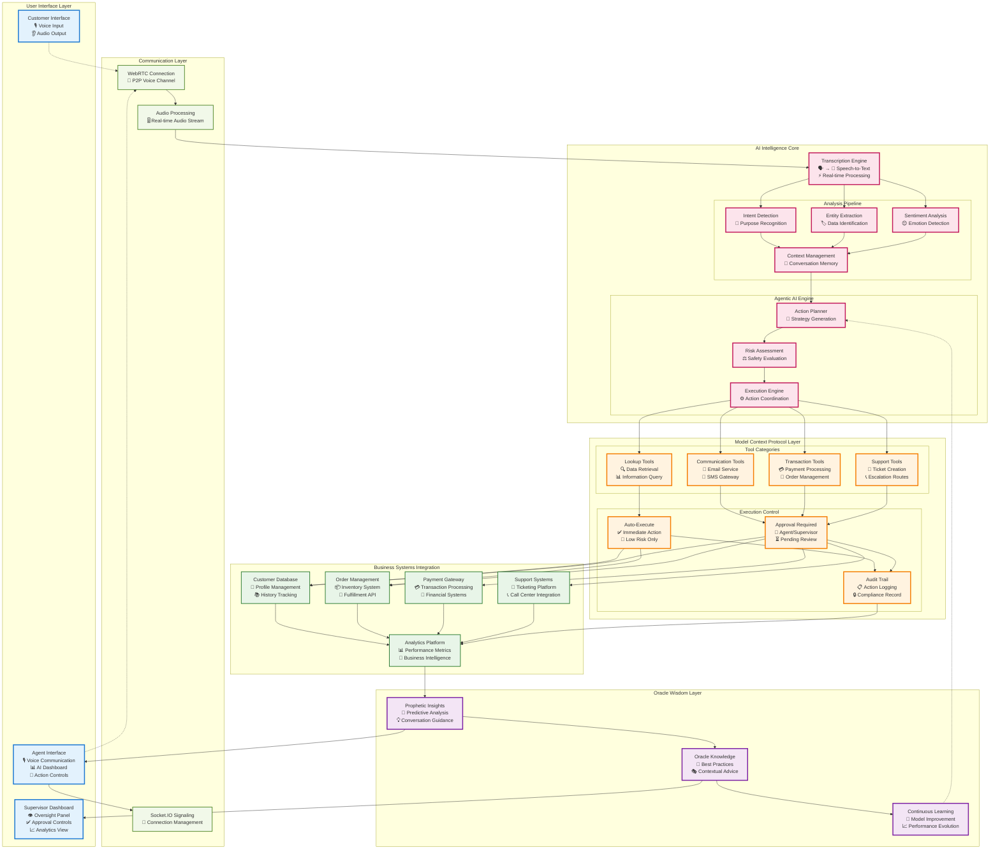
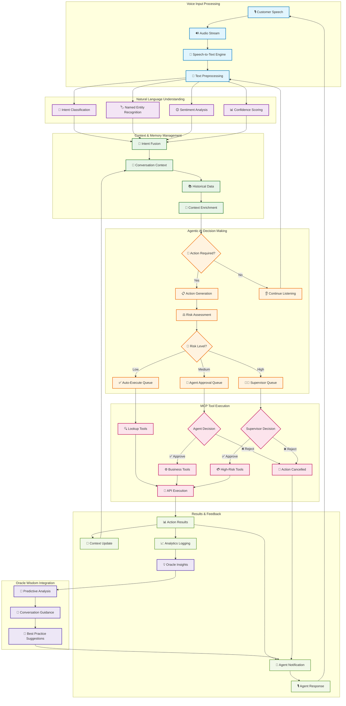
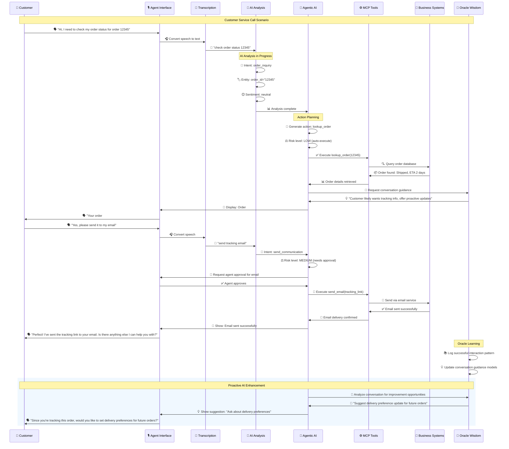

# Visual Architecture Design - Sybil AI MCP Integration

## Overview

This document provides comprehensive visual architecture designs for the Sybil AI voice platform with Model Context Protocol (MCP) integration. The designs showcase the evolution from basic WebRTC voice communication to advanced agentic AI capabilities.

---

## 1. System Overview Architecture



---

## 2. AI Processing Pipeline



---

## 3. Real-Time Conversation Flow



---

## 4. Security & Compliance Architecture

```mermaid
graph TB
    subgraph "Security Perimeter"
        subgraph "Authentication Layer"
            AUTH[🔐 Multi-Factor Authentication]
            RBAC[👥 Role-Based Access Control]
            JWT[🎫 JWT Token Management]
        end
        
        subgraph "Data Protection"
            ENCRYPT[🔒 End-to-End Encryption]
            VAULT[🏦 Secret Management]
            PII[🛡️ PII Protection]
        end
        
        subgraph "Network Security"
            FIREWALL[🚧 WAF & Firewall]
            VPN[🌐 VPN Gateway]
            DDOS[⚡ DDoS Protection]
        end
    end

    subgraph "Compliance Framework"
        subgraph "Audit & Logging"
            LOGS[📋 Comprehensive Logging]
            AUDIT[🔍 Audit Trail]
            MONITOR[👁️ Real-time Monitoring]
        end
        
        subgraph "Privacy Controls"
            GDPR[🇪🇺 GDPR Compliance]
            CCPA[🇺🇸 CCPA Compliance]
            CONSENT[✋ Consent Management]
        end
        
        subgraph "Industry Standards"
            SOC2[📜 SOC 2 Type II]
            HIPAA[🏥 HIPAA (Healthcare)]
            PCI[💳 PCI DSS (Payments)]
        end
    end

    subgraph "AI Ethics & Safety"
        subgraph "Bias Prevention"
            FAIR[⚖️ Fairness Testing]
            BIAS[🎯 Bias Detection]
            DIVERSE[🌍 Diverse Training Data]
        end
        
        subgraph "Explainability"
            EXPLAIN[💭 Decision Explanations]
            TRACE[🔗 Action Traceability]
            HUMAN[👤 Human Override]
        end
        
        subgraph "Safety Measures"
            LIMIT[🚨 Action Limitations]
            APPROVE[✅ Approval Workflows]
            KILL[🛑 Emergency Stop]
        end
    end

    subgraph "Risk Management"
        subgraph "Action Risk Assessment"
            LOW[🟢 Low Risk: Auto-Execute]
            MED[🟡 Medium Risk: Agent Approval]
            HIGH[🔴 High Risk: Supervisor Approval]
        end
        
        subgraph "Fraud Prevention"
            DETECT[🕵️ Anomaly Detection]
            BLOCK[🚫 Automatic Blocking]
            ALERT[📢 Security Alerts]
        end
        
        subgraph "Business Continuity"
            BACKUP[💾 Data Backup]
            RECOVERY[🔄 Disaster Recovery]
            FAILOVER[🔀 Automatic Failover]
        end
    end

    %% Connections
    AUTH --> ENCRYPT
    RBAC --> AUDIT
    JWT --> LOGS
    
    ENCRYPT --> GDPR
    VAULT --> SOC2
    PII --> CCPA
    
    FIREWALL --> MONITOR
    VPN --> AUDIT
    DDOS --> ALERT
    
    LOGS --> EXPLAIN
    AUDIT --> TRACE
    MONITOR --> DETECT
    
    FAIR --> LOW
    BIAS --> MED
    DIVERSE --> HIGH
    
    EXPLAIN --> APPROVE
    TRACE --> HUMAN
    HUMAN --> KILL
    
    LOW --> DETECT
    MED --> BLOCK
    HIGH --> ALERT
    
    DETECT --> BACKUP
    BLOCK --> RECOVERY
    ALERT --> FAILOVER

    %% Styling
    classDef security fill:#ffebee,stroke:#c62828,stroke-width:2px
    classDef compliance fill:#e8f5e8,stroke:#2e7d32,stroke-width:2px
    classDef ethics fill:#e3f2fd,stroke:#1565c0,stroke-width:2px
    classDef risk fill:#fff3e0,stroke:#ef6c00,stroke-width:2px
    
    class AUTH,RBAC,JWT,ENCRYPT,VAULT,PII,FIREWALL,VPN,DDOS security
    class LOGS,AUDIT,MONITOR,GDPR,CCPA,CONSENT,SOC2,HIPAA,PCI compliance
    class FAIR,BIAS,DIVERSE,EXPLAIN,TRACE,HUMAN,LIMIT,APPROVE,KILL ethics
    class LOW,MED,HIGH,DETECT,BLOCK,ALERT,BACKUP,RECOVERY,FAILOVER risk
```

---

## 5. Performance & Scalability Architecture

```mermaid
graph TB
    subgraph "Load Balancing & Distribution"
        LB[⚖️ Load Balancer<br/>Geographic Distribution]
        CDN[🌐 Content Delivery Network<br/>Edge Locations]
        CACHE[⚡ Redis Cache<br/>Session Management]
    end

    subgraph "Microservices Architecture"
        subgraph "Core Services"
            VOICE[🎙️ Voice Service<br/>WebRTC Management]
            AI_SVC[🤖 AI Service<br/>Analysis & Planning]
            MCP_SVC[⚙️ MCP Service<br/>Tool Execution]
            AUTH_SVC[🔐 Auth Service<br/>Security Management]
        end
        
        subgraph "Business Services"
            USER_SVC[👤 User Service<br/>Profile Management]
            ORDER_SVC[📦 Order Service<br/>Transaction Handling]
            COMM_SVC[📧 Communication Service<br/>Email/SMS Gateway]
            ANALYTICS_SVC[📊 Analytics Service<br/>Data Processing]
        end
    end

    subgraph "Data Layer"
        subgraph "Databases"
            POSTGRES[🐘 PostgreSQL<br/>Transactional Data]
            MONGO[🍃 MongoDB<br/>Conversation Logs]
            REDIS_DB[⚡ Redis<br/>Real-time Cache]
            ES[🔍 Elasticsearch<br/>Search & Analytics]
        end
        
        subgraph "Message Queues"
            KAFKA[📡 Apache Kafka<br/>Event Streaming]
            RABBIT[🐰 RabbitMQ<br/>Task Queues]
            BULL[🐂 Bull Queue<br/>Background Jobs]
        end
    end

    subgraph "AI/ML Infrastructure"
        subgraph "Model Serving"
            TF_SERVE[🧠 TensorFlow Serving<br/>ML Model APIs]
            HUGGING[🤗 Hugging Face<br/>NLP Models]
            OPENAI[🔮 OpenAI API<br/>GPT Integration]
        end
        
        subgraph "Training Pipeline"
            TRAIN[🎓 Model Training<br/>Continuous Learning]
            EVAL[📊 Model Evaluation<br/>Performance Metrics]
            DEPLOY[🚀 Model Deployment<br/>Automated Rollout]
        end
    end

    subgraph "Monitoring & Observability"
        subgraph "Metrics"
            PROM[📊 Prometheus<br/>Metrics Collection]
            GRAFANA[📈 Grafana<br/>Visualization]
            ALERT[🚨 AlertManager<br/>Incident Response]
        end
        
        subgraph "Logging"
            ELK[📝 ELK Stack<br/>Log Aggregation]
            JAEGER[🔗 Jaeger<br/>Distributed Tracing]
            SENTRY[🐛 Sentry<br/>Error Tracking]
        end
    end

    subgraph "Infrastructure"
        subgraph "Container Orchestration"
            K8S[☸️ Kubernetes<br/>Container Management]
            DOCKER[🐳 Docker<br/>Containerization]
            HELM[⛵ Helm<br/>Package Management]
        end
        
        subgraph "Cloud Services"
            AWS[☁️ AWS<br/>Primary Cloud]
            AZURE[🔷 Azure<br/>AI Services]
            GCP[🔵 Google Cloud<br/>ML Platform]
        end
    end

    %% Connections
    LB --> VOICE
    LB --> AI_SVC
    CDN --> VOICE
    CACHE --> AUTH_SVC
    
    VOICE --> POSTGRES
    AI_SVC --> MONGO
    MCP_SVC --> REDIS_DB
    AUTH_SVC --> POSTGRES
    
    USER_SVC --> POSTGRES
    ORDER_SVC --> POSTGRES
    COMM_SVC --> RABBIT
    ANALYTICS_SVC --> ES
    
    AI_SVC --> KAFKA
    MCP_SVC --> KAFKA
    ANALYTICS_SVC --> KAFKA
    
    AI_SVC --> TF_SERVE
    AI_SVC --> HUGGING
    AI_SVC --> OPENAI
    
    TF_SERVE --> TRAIN
    HUGGING --> EVAL
    OPENAI --> DEPLOY
    
    VOICE --> PROM
    AI_SVC --> PROM
    MCP_SVC --> PROM
    PROM --> GRAFANA
    GRAFANA --> ALERT
    
    VOICE --> ELK
    AI_SVC --> ELK
    MCP_SVC --> ELK
    ELK --> JAEGER
    JAEGER --> SENTRY
    
    VOICE --> K8S
    AI_SVC --> K8S
    MCP_SVC --> K8S
    K8S --> DOCKER
    DOCKER --> HELM
    
    K8S --> AWS
    TF_SERVE --> AZURE
    HUGGING --> GCP

    %% Styling
    classDef loadLayer fill:#e1f5fe,stroke:#0277bd,stroke-width:2px
    classDef serviceLayer fill:#f3e5f5,stroke:#7b1fa2,stroke-width:2px
    classDef dataLayer fill:#e8f5e8,stroke:#2e7d32,stroke-width:2px
    classDef aiLayer fill:#fff3e0,stroke:#ef6c00,stroke-width:2px
    classDef monitorLayer fill:#fce4ec,stroke:#c2185b,stroke-width:2px
    classDef infraLayer fill:#f1f8e9,stroke:#689f38,stroke-width:2px
    
    class LB,CDN,CACHE loadLayer
    class VOICE,AI_SVC,MCP_SVC,AUTH_SVC,USER_SVC,ORDER_SVC,COMM_SVC,ANALYTICS_SVC serviceLayer
    class POSTGRES,MONGO,REDIS_DB,ES,KAFKA,RABBIT,BULL dataLayer
    class TF_SERVE,HUGGING,OPENAI,TRAIN,EVAL,DEPLOY aiLayer
    class PROM,GRAFANA,ALERT,ELK,JAEGER,SENTRY monitorLayer
    class K8S,DOCKER,HELM,AWS,AZURE,GCP infraLayer
```



---

## 6. Interactive Dashboard Design

```mermaid
graph TB
    subgraph "Oracle AI Dashboard - Agent View"
        subgraph "Real-Time Status Panel"
            STATUS[🟢 Connection Status<br/>📞 Active Call: Customer #789<br/>⏱️ Duration: 12:34]
            TRANSCRIBE[📝 Live Transcription<br/>🗣️ "I need help with my refund..."<br/>🎯 Confidence: 95%]
        end
        
        subgraph "AI Insights Panel"
            SENTIMENT[😊 Sentiment Analysis<br/>Current: Frustrated (65%)<br/>Trend: ↗️ Improving]
            INTENT[🎯 Intent Detection<br/>Primary: refund_request<br/>Secondary: account_inquiry]
            ENTITIES[🏷️ Extracted Entities<br/>Order: #12345<br/>Amount: $299.99<br/>Date: 2024-01-15]
        end
        
        subgraph "Oracle Wisdom"
            GUIDANCE[🔮 Conversation Guidance<br/>💡 "Customer shows refund urgency"<br/>📜 "Use empathetic language"<br/>⚡ "Offer expedited processing"]
            PREDICTIONS[🎯 Predictive Insights<br/>🔄 "Likely to accept store credit"<br/>📈 "75% satisfaction probability"<br/>🎁 "Suggest loyalty discount"]
        end
        
        subgraph "Agentic Actions"
            PENDING[⏳ Pending Actions<br/>🔍 lookup_order(#12345) ✅<br/>💳 process_refund($299.99) 🤝<br/>📧 send_confirmation() 🤝]
            EXECUTED[✅ Completed Actions<br/>🔍 Order details retrieved<br/>📊 Customer history loaded<br/>⚖️ Refund eligibility confirmed]
        end
        
        subgraph "Approval Controls"
            APPROVE[✅ Approve Refund<br/>💳 Process $299.99 refund<br/>📧 Send confirmation email]
            REJECT[❌ Request Supervisor<br/>🔄 Escalate to manager<br/>📞 Transfer call]
            MODIFY[✏️ Modify Action<br/>💰 Offer $250 store credit<br/>⏰ 24-hour processing]
        end
        
        subgraph "Context & History"
            CUSTOMER[👤 Customer Profile<br/>Name: Sarah Johnson<br/>Tier: Gold Member<br/>History: 15 orders, 2 returns]
            PREVIOUS[📚 Previous Interactions<br/>Last call: 2023-12-10<br/>Issue: Shipping delay<br/>Resolution: Satisfied]
        end
    end

    subgraph "Performance Metrics"
        METRICS[📊 Real-Time Metrics<br/>🎯 Resolution Rate: 94%<br/>⏱️ Avg Call Time: 8:45<br/>😊 Satisfaction: 4.7/5<br/>🤖 AI Accuracy: 97%]
        GOALS[🏆 Daily Goals<br/>📞 Calls: 23/30<br/>⭐ Quality: 4.8/5.0<br/>⚡ Speed: 7:30/8:00<br/>🎯 First Call Resolution: 89%]
    end

    %% Connections showing data flow
    STATUS -.-> TRANSCRIBE
    TRANSCRIBE --> SENTIMENT
    TRANSCRIBE --> INTENT
    TRANSCRIBE --> ENTITIES
    
    SENTIMENT --> GUIDANCE
    INTENT --> GUIDANCE
    ENTITIES --> GUIDANCE
    
    GUIDANCE --> PREDICTIONS
    PREDICTIONS --> PENDING
    
    PENDING --> APPROVE
    PENDING --> REJECT
    PENDING --> MODIFY
    
    APPROVE --> EXECUTED
    EXECUTED --> METRICS
    
    CUSTOMER --> GUIDANCE
    PREVIOUS --> PREDICTIONS
    
    METRICS --> GOALS

    %% Styling
    classDef status fill:#e8f5e8,stroke:#2e7d32,stroke-width:2px
    classDef insights fill:#e3f2fd,stroke:#1565c0,stroke-width:2px
    classDef oracle fill:#f3e5f5,stroke:#7b1fa2,stroke-width:3px
    classDef actions fill:#fff3e0,stroke:#ef6c00,stroke-width:2px
    classDef controls fill:#ffebee,stroke:#c62828,stroke-width:2px
    classDef context fill:#fce4ec,stroke:#c2185b,stroke-width:2px
    classDef metrics fill:#f1f8e9,stroke:#689f38,stroke-width:2px
    
    class STATUS,TRANSCRIBE status
    class SENTIMENT,INTENT,ENTITIES insights
    class GUIDANCE,PREDICTIONS oracle
    class PENDING,EXECUTED actions
    class APPROVE,REJECT,MODIFY controls
    class CUSTOMER,PREVIOUS context
    class METRICS,GOALS metrics
```

---

## Implementation Notes

### Key Design Principles

1. **Oracle-Inspired Interface**: The dashboard embraces the mystical oracle theme with predictive insights and wisdom-driven guidance
2. **Real-Time Responsiveness**: All components update in real-time as conversations progress
3. **Intelligent Automation**: Low-risk actions execute automatically while maintaining human oversight for critical decisions
4. **Contextual Awareness**: Every action considers conversation history, customer profile, and business context
5. **Compliance-First**: Built-in audit trails, approval workflows, and security measures

### Visual Design Elements

- **Color-coded risk levels**: Green (auto), Yellow (approval), Red (supervisor)
- **Live status indicators**: Real-time connection, transcription, and AI analysis status
- **Progressive disclosure**: Complex information revealed contextually
- **Action-oriented layout**: Clear call-to-action buttons for agent decisions
- **Wisdom integration**: Oracle insights prominently displayed for guidance

### Technical Implementation

- **Component-based architecture**: Modular React components for each dashboard section
- **Real-time updates**: Socket.IO for live data streaming
- **State management**: Context API for global application state
- **Responsive design**: Tailwind CSS for adaptive layouts
- **Accessibility**: WCAG compliance for inclusive design

This visual architecture provides a comprehensive blueprint for implementing the Sybil AI MCP integration with a focus on usability, security, and the unique oracle-inspired user experience.
